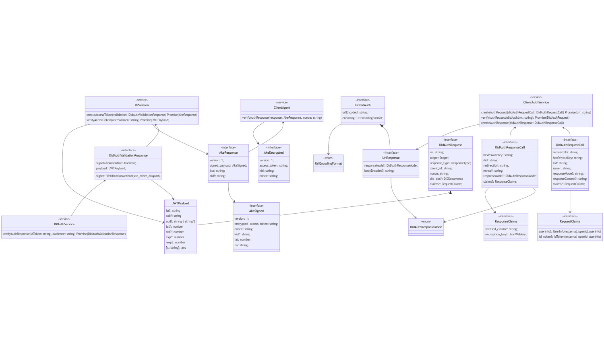

<h1 style="text-align: center; vertical-align: middle">
  <a href="https://www.gimly.io/"> &nbsp;Gimly</a> &nbsp;and &nbsp; <a href="https://www.sphereon.com"></a>

Self Issued OpenID Provider v2 (SIOP)  
</h1>
<br>

An authentication library for having clients/people conforming to the [Self Issued OpenID Provider v2 (SIOPv2)](https://openid.net/specs/openid-connect-self-issued-v2-1_0.html) and  [OpenID Connect for Verifiable Presentations (OIDC4VP)](https://openid.net/specs/openid-connect-4-verifiable-presentations-1_0.html) as specified in the OpenID Connect working group.

## Introduction
SIOP v2 is an extension of OpenID Connect to allow End-users to act as OpenID Providers (OPs) themselves. Using Self-Issued OPs, End-users can authenticate themselves and present claims directly to the Relying Parties (RPs), typically a webapp,  without relying on a third-party Identity Provider. This makes the solution fully self sovereign, as it does not rely on any third parties and strictly happens peer 2 peer, but still uses the OpenID Connect protocol.

Next to the user acting as an OpenID Provider, this library also includes support for Verifiable Presentations using the [Presentation Exchange](https://identity.foundation/presentation-exchange/) support provided by our [pe-js](https://github.com/Sphereon-Opensource/pe-js) library. This means that the Relying Party can pose submission requirements on the Verifiable Credentials it would like to receive from the client/OP. The OP then checks whether it has the credentials to support the submission requirements. Only if that is the case it will send the relevant (parts of the) credentials as a Verifiable Presentation in the Authentication Response destined for the Webapp/Relying Party. The relying party in turn checks validity of the Verifiable Presentation(s) as well as the match with the submission requirements. Only if everything is verified successfully the RP serves the protected page(s). This means that the authentication can be extended with claims about the authenticating entity, but it can also be used to easily consume credentials from supporting applications, without having to setup DIDComm connections for instance.

The term Self-Issued comes from the fact that the End-users (OP) issue self-signed ID Tokens to prove validity of the identifiers and claims. This is a trust model different from that of the rest of OpenID Connect where OP is run by the third party who issues ID Tokens on behalf of the End-user to the Relying Party upon the End-user's consent. This means the End-User is in control about his/her data instead of the 3rd party OP.

## Service
The DID Auth SIOP v2 library consists of a group of services and classes to:

- [Decentralized Identifiers (DID)](https://www.w3.org/TR/did-core/) method neutral: Resolve DIDs using DIFs [did-resolver](https://github.com/decentralized-identity/did-resolver) and Sphereon's [Universal registrar and resolver client](https://github.com/Sphereon-Opensource/did-uni-client)
- Verify and Create Json Web Tokens (JWTs) as used in OpenID Connect using Decentralized Identifiers (DIDs)
- OP class to create Authentication Requests and verify Authentication Responses
- RP class to verify Authentication Requests and create Authentication Responses
- Verifiable Presentation and Presentation Exchange support on the RP and OP sides


## Steps involved

Flow diagram:


1. Client (OP) initiates an Auth request by POST-ing to an endpoint, like for instance `/did-siop/v1/authentications` or clicking a Login button and scanning a QR code
2. Web (RP) receives the request and access the RP object which creates the authentication request as JWT, signs it and returns the response as an OpenID Connect URI 
   1. JWT example:
    ```json
    // JWT Header
    {
      "alg": "ES256K",
      "kid": "did:ethr:0xcBe71d18b5F1259faA9fEE8f9a5FAbe2372BE8c9#controller",
      "typ": "JWT"
    }
     
    // JWT Payload
   {
      "iat": 1632336634,
      "exp": 1632337234,
      "response_type": "id_token",
      "scope": "openid",
      "client_id": "did:ethr:0xcBe71d18b5F1259faA9fEE8f9a5FAbe2372BE8c9",
      "redirect_uri": "https://acme.com/siop/v1/sessions",
      "iss": "did:ethr:0xcBe71d18b5F1259faA9fEE8f9a5FAbe2372BE8c9",
      "response_mode": "post",
      "nonce": "qBrR7mqnY3Qr49dAZycPF8FzgE83m6H0c2l0bzP4xSg",
      "state": "b32f0087fc9816eb813fd11f",
      "registration": {
         "did_methods_supported": [
          "did:ethr:",
          "did:eosio:"
         ],
         "subject_identifiers_supported": "did"
      }
   }
    ```
   
   2. The Signed JWT, called the JWS follows the following scheme (JWS Compact Serialization, https://datatracker.ietf.org/doc/html/rfc7515#section-7.1): 
   
   `BASE64URL(UTF8(JWT Protected Header)) || '.' ||
   BASE64URL(JWT Payload) || '.' ||
   BASE64URL(JWS Signature)`

   3. Create the URI containing the JWS: 
   ```
   openid://?response_type=id_token 
      &scope=openid
      &client_id=did%3Aethr%3A0xBC9484414c1DcA4Aa85BadBBd8a36E3973934444
      &redirect_uri=https%3A%2F%2Frp.acme.com%2Fsiop%2Fjwts
      &iss=did%3Aethr%3A0xBC9484414c1DcA4Aa85BadBBd8a36E3973934444
      &response_mode=post
      &nonce=qBrR7mqnY3Qr49dAZycPF8FzgE83m6H0c2l0bzP4xSg&state=b32f0087fc9816eb813fd11f
      &registration=%5Bobject%20Object%5D
      &request=<JWS here>
   ```
3. Web receives the Auth Request URI Object from RP
4. Web sends the Auth Request URI in the response body to the client
5. Client accesses OP object to create an Authentication response
6. OP verifies the authentication request, including checks on whether the RP did and keytypes are supported, next to whether the OP can satisfy the RPs requested Verifiable Credentials
7. OP creates the authentication response object as follows:
   1. Create an ID token as shown below:

    ````json
    // JWT encoded ID Token
    // JWT Header
    {
      "alg": "ES256K",
      "kid": "did:ethr:0x998D43DA5d9d78500898346baf2d9B1E39Eb0Dda#keys-1",
      "typ": "JWT",
    }
    // JWT Payload
   {
      "iat": 1632343857.084,
      "exp": 1632344857.084,
      "iss": "https://self-issued.me/v2",
      "sub": "did:ethr:0x998D43DA5d9d78500898346baf2d9B1E39Eb0Dda",
      "aud": "https://acme.com/siop/v1/sessions",
      "did": "did:ethr:0x998D43DA5d9d78500898346baf2d9B1E39Eb0Dda",
      "sub_type": "did",
      "sub_jwk": {
         "kid": "did:ethr:0x998D43DA5d9d78500898346baf2d9B1E39Eb0Dda#key-1",
         "kty": "EC",
         "crv": "secp256k1",
         "x": "a4IvJILPHe3ddGPi9qvAyXY9qMTEHvQw5DpQYOJVA0c",
         "y": "IKOy0JfBF8FOlsOJaC41xiKuGc2-_iqTI01jWHYIyJU"
      },
      "nonce": "qBrR7mqnY3Qr49dAZycPF8FzgE83m6H0c2l0bzP4xSg",
      "state": "b32f0087fc9816eb813fd11f",
      "registration": {
         "issuer": "https://self-issued.me/v2",
         "response_types_supported": "id_token",
         "authorization_endpoint": "openid:",
         "scopes_supported": "openid",
         "id_token_signing_alg_values_supported": [
            "ES256K",
            "EdDSA"
         ],
         "request_object_signing_alg_values_supported": [
            "ES256K",
            "EdDSA"
         ],
         "subject_types_supported": "pairwise"
      }
   }
    ````

    2. Sign the ID token using the DID key (kid) using JWS scheme (JWS Compact Serialization, https://datatracker.ietf.org/doc/html/rfc7515#section-7.1) and send it to the RP:

   `BASE64URL(UTF8(JWS Protected Header)) || '.' ||
   BASE64URL(JWS Payload) || '.' ||
   BASE64URL(JWS Signature)`

8. OP returns the Auth response and jwt object to the client
9. Client does an HTTP POST to redirect_uri from the request (and the aud in the response): https://acme.com/siop/v1/sessions using "application/x-www-form-urlencoded"
10. Web receives the ID token (auth response) and uses the RP's object verify method 
11. RP performs the validation of the token, including signature validation, expiration and Verifiable Presentations if any. It returns the Verified Auth Response to WEB
12. WEB returns a 200 response to Client with a redirect to another page (logged in or confirmation of VP receipt etc).
13. From that moment on Client can use the Auth Response as bearer token as long as it is valid
## DID resolution

### Description
Resolves the DID to a DID document using the DID method provided in didUrl and using DIFs [did-resolver](https://github.com/decentralized-identity/did-resolver) and Sphereons [Universal registrar and resolver client](https://github.com/Sphereon-Opensource/did-uni-client). 

This process allows retrieving public keys and verificationMethod material, as well as services provided by a DID controller. Can be used in both the webapp and mobile applications. Uses the did-uni-client, but could use other DIF did-resolver drivers as well. The benefit of the uni client is that it can resolve many DID methods. Since the resolution itself is provided by the mentioned external dependencies above, we suffice with a usage example.

#### Usage
```typescript
import { Resolver } from 'did-resolver'
import { getResolver as getUniResolver } from '@sphereon/did-uni-client'

const resolver = new Resolver(getUniResolver('ethr'));

resolver.resolve('did:ethr:0x998D43DA5d9d78500898346baf2d9B1E39Eb0Dda').then(doc => console.log)
```

The DidResolution file exposes 2 functions that help with the resolution as well:
```typescript
import { getResolver, resolveDidDocument } from './functions/DIDResolution';

// combines 2 uni resolvers for ethr and eosio together with the myCustomResolver and return that as a single resolver
const myCustomResolver = new MyCustomResolver();
getResolver({ didMethods: ["ethr", "eosio"], resolver: myCustomResolver });

// Returns a DID document for the specified DID, using the universal resolver client for the ehtr DID method
await resolveDidDocument('did:ethr:0x998D43DA5d9d78500898346baf2d9B1E39Eb0Dda', { didMethods: ["ethr"]});
```

## JWT and DID creation and verification
Please note that this chapter is about low level JWT functions, which normally aren't used by end users of this library. Typically, you use the AuthenticationRequest and Response classes (low-level) or the OP and RP classes (high-level).

### Create JWT
Creates a signed JWT given a DID which becomes the issuer, a signer function, and a payload over which the signature is created.

#### Data Interface
```typescript
export interface JWTPayload { // This is a standard JWT payload described on for instance https://jwt.io
  iss?: string
  sub?: string
  aud?: string | string[]
  iat?: number
  nbf?: number
  exp?: number
  rexp?: number
  jti?: string;
  [x: string]: any
}

export interface JWTHeader { // This is a standard JWT header
    typ: 'JWT'
    alg: string             // The JWT signing algorithm to use. Supports: [ES256K, ES256K-R, Ed25519, EdDSA], Defaults to: ES256K
    [x: string]: any
}

export interface JWTOptions {
    issuer: string          // The DID of the issuer (signer) of JWT
    signer: Signer          // A signer function, eg: `ES256KSigner` or `EdDSASigner`
    expiresIn?: number      // optional expiration time
    canonicalize?: boolean  // optional flag to canonicalize header and payload before signing
}
```

#### Usage
````typescript
const signer = ES256KSigner(process.env.PRIVATE_KEY);
createDidJWT({requested: ['name', 'phone']}, {issuer: 'did:eosio:example', signer}).then(jwt => console.log)
````

### Verify JWT
Verifies the given JWT. If the JWT is valid, the promise returns an object including the JWT, the payload of the JWT, and the DID Document of the issuer of the JWT, using the resolver mentioned earlier. The checks performed include, general JWT decoding, DID resolution, Proof purposes

proof purposes allows restriction of verification methods to the ones specifically listed, otherwise the 'authentication' verification method of the resolved DID document will be used

#### Data Interface
Verify options:
```typescript
export interface JWTVerifyOptions {
  audience?: string                            // DID of the recipient of the JWT
  callbackUrl?: string                         // callback url in JWT
  skewTime?: number                            // Allow to skey time in the expiration check with this amount
  proofPurpose?: ProofPurposeTypes             // Restrict to this proof purpose type in the DID resolution
}
```
Response:
```typescript
export interface VerifiedJWT {
    payload: Partial<JWTPayload>                // Standard partial JWT payload, see above
    didResolutionResult: DIDResolutionResult    // The DID resolution
    issuer?: string                             // The DID that issued the JWT
    signer?: VerificationMethod                 // The verification method that issued the JWT
    jwt: string                                 // The JWT itself
}

export interface VerificationMethod {
    id: string                      // The id of the key
    type: string                    // authentication, assertionMethod etc (see DID spec)
    controller: string              // The controller of the Verification method
    publicKeyBase58?: string        // Public key in base58 if any
    publicKeyJwk?: JsonWebKey       // Public key in JWK if any
    publicKeyHex?: string           // Public key in hex if any
    blockchainAccountId?: string    // optional blockchain account id associated with the DID
    ethereumAddress?: string        // deprecated
}
```

#### Usage
```typescript
verifyDidJWT(jwt, resolver, {audience: '6B2bRWU3F7j3REx3vkJ..'}).then(verifiedJWT => {
       const did = verifiedJWT.issuer;                          // DID of signer
       const payload = verifiedJWT.payload;                     // The JHT payload
       const doc = verifiedJWT.didResolutionResult.didDocument; // DID Document of signer
       const jwt = verifiedJWT.jwt;                             // JWS in string format 
       const signerKeyId = verifiedJWT.signer.id;               // ID of key in DID document that signed JWT
       ...
   });
```


## AuthenticationRequest class

### createURI
Create a signed URL encoded URI with a signed SIOP Authentication request 

#### Data Interface
```typescript
interface AuthenticationRequestURI extends SIOPURI {
   jwt?: string;                                    // The JWT when requestBy was set to mode Reference, undefined if the mode is Value
   requestOpts: AuthenticationRequestOpts;          // The supplied request opts as passed in to the method
   requestPayload: AuthenticationRequestPayload;    // The json payload that ends up signed in the JWT
}
export type SIOPURI = {
   encodedUri: string;                  // The encode JWT as URI
   encodingFormat: UrlEncodingFormat;   // The encoding format used
};

// https://openid.net/specs/openid-connect-self-issued-v2-1_0.html#section-8
export interface AuthenticationRequestOpts {
   redirectUri: string;                // The redirect URI
   requestBy: ObjectBy;                // Whether the request is returned by value in the URI or retrieved by reference at the provided URL
   signatureType: InternalSignature | ExternalSignature | NoSignature; // Whether no signature is being used, internal (access to private key), or external (hosted using authentication)
   responseMode?: ResponseMode;        // How the URI should be returned. This is not being used by the library itself, allows an implementor to make a decision
   responseContext?: ResponseContext;  // Defines the context of these opts. Either RP side or OP side
   claims?: OidcClaim;                 // The claims
   registration: RequestRegistrationOpts; // Registration metadata options
   nonce?: string;                     // An optional nonce, will be generated if not provided
   state?: string;                     // An optional state, will be generated if not provided

   // slint-disable-next-line @typescript-eslint/no-explicit-any
   // [x: string]: any;
}

static async createURI(opts: SIOP.AuthenticationRequestOpts): Promise<SIOP.AuthenticationRequestURI>
```

#### Usage
```typescript
const EXAMPLE_REDIRECT_URL = "https://acme.com/hello";
const EXAMPLE_REFERENCE_URL = "https://rp.acme.com/siop/jwts";
const HEX_KEY = "f857544a9d1097e242ff0b287a7e6e90f19cf973efe2317f2a4678739664420f";
const DID = "did:ethr:0x0106a2e985b1E1De9B5ddb4aF6dC9e928F4e99D0";
const KID = "did:ethr:0x0106a2e985b1E1De9B5ddb4aF6dC9e928F4e99D0#keys-1";

const opts = {
   redirectUri: EXAMPLE_REDIRECT_URL,
   requestBy: {
      type: SIOP.PassBy.VALUE,
   },
   signatureType: {
      hexPrivateKey: HEX_KEY,
      did: DID,
      kid: KID,
   },
   registration: {
      didMethodsSupported: ['did:ethr:'],
      subjectIdentifiersSupported: SubjectIdentifierType.DID,
      registrationBy: {
         type: SIOP.PassBy.VALUE,
      },
   }
};

AuthenticationRequest.createURI(opts)
    .then(uri => console.log(uri.encodedUri));

// Output: 
// 
// openid://
//      ?response_type=id_token
//      &scope=openid
//      &client_id=did%3Aethr%3A0x0106a2e985b1E1De9B5ddb4aF6dC9e928F4e99D0
//      &redirect_uri=https%3A%2F%2Facme.com%2Fhello
//      &iss=did%3Aethr%3A0x0106a2e985b1E1De9B5ddb4aF6dC9e928F4e99D0
//      &response_mode=post
//      &response_context=rp
//      &nonce=aTO_jvEBPyigHFIueD1cT657LxVZwWxBesd2v6LVnjA
//      &state=b34b64db619e798b317fd4c0
//      &registration=%5Bobject%20Object%5D
//      &request=eyJhbGciOiJFUzI1NksiLCJraWQiOiJkaWQ6ZXRocjoweDAxMDZhMmU5ODViMUUxRGU5QjVkZGI0YUY2ZEM5ZTkyOEY0ZTk5RDAja2V5cy0xIiwidHlwIjoiSldUIn0.eyJpYXQiOjE2MzIzNTAxNDYsImV4cCI6MTYzMjM1MDc0NiwicmVzcG9uc2VfdHlwZSI6ImlkX3Rva2VuIiwic2NvcGUiOiJvcGVuaWQiLCJjbGllbnRfaWQiOiJkaWQ6ZXRocjoweDAxMDZhMmU5ODViMUUxRGU5QjVkZGI0YUY2ZEM5ZTkyOEY0ZTk5RDAiLCJyZWRpcmVjdF91cmkiOiJodHRwczovL2FjbWUuY29tL2hlbGxvIiwiaXNzIjoiZGlkOmV0aHI6MHgwMTA2YTJlOTg1YjFFMURlOUI1ZGRiNGFGNmRDOWU5MjhGNGU5OUQwIiwicmVzcG9uc2VfbW9kZSI6InBvc3QiLCJyZXNwb25zZV9jb250ZXh0IjoicnAiLCJub25jZSI6Im1kSFdxQnc1TlRkNTVlckJjcFlBdmNrMEdVOHRDQWZJYUdscVVHVE1rREEiLCJzdGF0ZSI6ImYyYTIzYTNkZDI2MWQ4NTczOGE1ZWMyYyIsInJlZ2lzdHJhdGlvbiI6eyJkaWRfbWV0aG9kc19zdXBwb3J0ZWQiOlsiZGlkOmV0aHI6Il0sInN1YmplY3RfaWRlbnRpZmllcnNfc3VwcG9ydGVkIjoiZGlkIn19.gPLLvFhD77MJC7IulbvdZ1dm0A1pXMh5VxFfz1ExMA_IQZmBdjyXih6RMWvYFh3Hn0Cn8R_su-ki5OP9HH7jLQ


```


### verifyJWT
Verifies a SIOP Authentication Request JWT. Throws an error if the verifation fails. Returns the verified JWT and metadata if the verification succeeds

#### Data Interface
```typescript
export interface VerifiedAuthenticationRequestWithJWT extends VerifiedJWT {
   payload: AuthenticationRequestPayload;       // The unsigned Authentication Request payload
   verifyOpts: VerifyAuthenticationRequestOpts; // The verification options for the authentication request
}

export interface VerifiedJWT {
   payload: Partial<JWTPayload>;            // The JWT payload
   didResolutionResult: DIDResolutionResult;// DID resolution result including DID document
   issuer: string;                          // The issuer (did) of the JWT
   signer: VerificationMethod;              // The matching verification method from the DID that was used to sign
   jwt: string;                             // The JWT
}

export interface VerifyAuthenticationRequestOpts {
   verification: InternalVerification | ExternalVerification;  // To use internal verification or external hosted verification
   nonce?: string; // If provided the nonce in the request needs to match
}

export interface DIDResolutionResult {
   didResolutionMetadata: DIDResolutionMetadata // Did resolver metadata
   didDocument: DIDDocument                     // The DID document
   didDocumentMetadata: DIDDocumentMetadata     // DID document metadata
}

export interface DIDDocument {              // Standard DID Document, see DID spec for explanation
    '@context'?: 'https://www.w3.org/ns/did/v1' | string | string[]
    id: string
    alsoKnownAs?: string[]
    controller?: string | string[]
    verificationMethod?: VerificationMethod[]
    authentication?: (string | VerificationMethod)[]
    assertionMethod?: (string | VerificationMethod)[]
    keyAgreement?: (string | VerificationMethod)[]
    capabilityInvocation?: (string | VerificationMethod)[]
    capabilityDelegation?: (string | VerificationMethod)[]
    service?: ServiceEndpoint[]
}

static async verifyJWT(jwt: string, opts: SIOP.VerifyAuthenticationRequestOpts): Promise<SIOP.VerifiedAuthenticationRequestWithJWT>
```
#### Usage

````typescript
const verifyOpts: VerifyAuthenticationRequestOpts = {
   verification: {
      mode: VerificationMode.INTERNAL,
      resolveOpts: {
         didMethods: ["ethr"]
      }
   },
}
const jwt = 'ey..........' // JWT created by RP
AuthenticationRequest.verifyJWT(jwt).then(req => {
   console.log(`issuer: ${req.issuer}`);
   console.log(JSON.stringify(req.signer));
});
// issuer: "did:ethr:0x56C4b92D4a6083Fcee825893A29023cDdfff5c66"
// "signer": {
//      "id": "did:ethr:0x56C4b92D4a6083Fcee825893A29023cDdfff5c66#controller",
//      "type": "EcdsaSecp256k1RecoveryMethod2020",
//      "controller": "did:ethr:0x56C4b92D4a6083Fcee825893A29023cDdfff5c66",
//      "blockchainAccountId": "0x56C4b92D4a6083Fcee825893A29023cDdfff5c66@eip155:1"
// }
````

## AuthenticationResponse class

### verifyAuthResponse
Verifies a DidAuth ID Response Token and the audience. Return a DID Auth Validation Response, which contains the JWT payload as well as the verification method that signed the JWT.

#### Data interface
````typescript

export interface DidAuthValidationResponse {
    signatureValidation: boolean;               // Whether the signature needs to be validated (defaults tot true)
    signer: VerificationMethod;                 // DID VerificationMethod  (described already before)
    payload: JWTPayload;                        // The JWT Payload (described already before)
}


verifyAuthResponse(idToken: string, audience: string): Promise<DidAuthValidationResponse>;
````

#### Usage
````typescript
verifyAuthResponse('ey....', 'my-audience').then(resp => {
    console.log(JSON.stringify(resp.signer));
    // output: 
    //{
    //    id: 'did:eosio:example#key-0',
    //    type: 'authentication',
    //    controller: 'did:eosio:example',
    //    publicKeyHex: '1a3b....'
    //}
    
    console.log(resp.payload.nonce);
    // output: 5c1d29c1-cf7d-4e14-9305-9db46d8c1916
});
````


### verifyAccessToken
Verifies the bearer access token on the RP side as received from the OP/client. Throws an error if the token is invalid, otherwise returns the JWT

#### Data Interface
````typescript
export interface JWTPayload { // A default JWT Payload
    iss?: string
    sub?: string
    aud?: string | string[]
    iat?: number
    nbf?: number
    exp?: number
    rexp?: number
    [x: string]: any
}
verifyAccessToken(accessToken: string, opts?: { [key: string]: string | number; }): Promise<JWTPayload>;
````

#### Usage
````typescript
verifyAccessToken('ey......').then(jwt => {
    console.log(`iss: ${jwt.iss}`);
    // output: iss: did:eosio:example
})
````
## Class and Flow diagram of the interactions

DID JWTs:

[![](https://mermaid.ink/img/eyJjb2RlIjoiY2xhc3NEaWFncmFtXG5jbGFzcyBEaWRSZXNvbHV0aW9uT3B0aW9ucyB7XG4gICAgPDxpbnRlcmZhY2U-PlxuICAgIGFjY2VwdD86IHN0cmluZ1xufVxuY2xhc3MgUmVzb2x2YWJsZSB7XG4gICAgPDxpbnRlcmZhY2U-PlxuICAgIHJlc29sdmUoZGlkVXJsOiBzdHJpbmcsIG9wdGlvbnM6IERpZFJlc29sdXRpb25PcHRpb25zKSBQcm9taXNlKERpZFJlc29sdXRpb25SZXN1bHQpXG59XG5EaWRSZXNvbHV0aW9uT3B0aW9ucyA8LS0gUmVzb2x2YWJsZVxuRElEUmVzb2x1dGlvblJlc3VsdCA8LS0gUmVzb2x2YWJsZVxuXG5jbGFzcyAgRElEUmVzb2x1dGlvblJlc3VsdCB7XG4gIGRpZFJlc29sdXRpb25NZXRhZGF0YTogRElEUmVzb2x1dGlvbk1ldGFkYXRhXG4gIGRpZERvY3VtZW50OiBESUREb2N1bWVudCB8IG51bGxcbiAgZGlkRG9jdW1lbnRNZXRhZGF0YTogRElERG9jdW1lbnRNZXRhZGF0YVxufVxuRElERG9jdW1lbnRNZXRhZGF0YSA8LS0gRElEUmVzb2x1dGlvblJlc3VsdFxuRElERG9jdW1lbnQgPC0tIERJRFJlc29sdXRpb25SZXN1bHRcblxuY2xhc3MgRElERG9jdW1lbnRNZXRhZGF0YSB7XG4gIGNyZWF0ZWQ_OiBzdHJpbmdcbiAgdXBkYXRlZD86IHN0cmluZ1xuICBkZWFjdGl2YXRlZD86IGJvb2xlYW5cbiAgdmVyc2lvbklkPzogc3RyaW5nXG4gIG5leHRVcGRhdGU_OiBzdHJpbmdcbiAgbmV4dFZlcnNpb25JZD86IHN0cmluZ1xuICBlcXVpdmFsZW50SWQ_OiBzdHJpbmdcbiAgY2Fub25pY2FsSWQ_OiBzdHJpbmdcbn1cblxuY2xhc3MgRElERG9jdW1lbnQge1xuICAgIDw8aW50ZXJmYWNlPj5cbiAgICAnQGNvbnRleHQnPzogJ2h0dHBzOi8vd3d3LnczLm9yZy9ucy9kaWQvdjEnIHwgc3RyaW5nIHwgc3RyaW5nW11cbiAgICBpZDogc3RyaW5nXG4gICAgYWxzb0tub3duQXM_OiBzdHJpbmdbXVxuICAgIGNvbnRyb2xsZXI_OiBzdHJpbmcgfCBzdHJpbmdbXVxuICAgIHZlcmlmaWNhdGlvbk1ldGhvZD86IFZlcmlmaWNhdGlvbk1ldGhvZFtdXG4gICAgYXV0aGVudGljYXRpb24_OiAoc3RyaW5nIHwgVmVyaWZpY2F0aW9uTWV0aG9kKVtdXG4gICAgYXNzZXJ0aW9uTWV0aG9kPzogKHN0cmluZyB8IFZlcmlmaWNhdGlvbk1ldGhvZClbXVxuICAgIGtleUFncmVlbWVudD86IChzdHJpbmcgfCBWZXJpZmljYXRpb25NZXRob2QpW11cbiAgICBjYXBhYmlsaXR5SW52b2NhdGlvbj86IChzdHJpbmcgfCBWZXJpZmljYXRpb25NZXRob2QpW11cbiAgICBjYXBhYmlsaXR5RGVsZWdhdGlvbj86IChzdHJpbmcgfCBWZXJpZmljYXRpb25NZXRob2QpW11cbiAgICBzZXJ2aWNlPzogU2VydmljZUVuZHBvaW50W11cbn1cblZlcmlmaWNhdGlvbk1ldGhvZCA8LS0gRElERG9jdW1lbnRcblxuY2xhc3MgVmVyaWZpY2F0aW9uTWV0aG9kIHtcbiAgICA8PGludGVyZmFjZT4-XG4gICAgaWQ6IHN0cmluZ1xuICAgIHR5cGU6IHN0cmluZ1xuICAgIGNvbnRyb2xsZXI6IHN0cmluZ1xuICAgIHB1YmxpY0tleUJhc2U1OD86IHN0cmluZ1xuICAgIHB1YmxpY0tleUp3az86IEpzb25XZWJLZXlcbiAgICBwdWJsaWNLZXlIZXg_OiBzdHJpbmdcbiAgICBibG9ja2NoYWluQWNjb3VudElkPzogc3RyaW5nXG4gICAgZXRoZXJldW1BZGRyZXNzPzogc3RyaW5nXG59XG5cbmNsYXNzIEpXVFBheWxvYWQge1xuICAgIDw8aW50ZXJmYWNlPj5cbiAgICBpc3M6IHN0cmluZ1xuICAgIHN1Yj86IHN0cmluZ1xuICAgIGF1ZD86IHN0cmluZyB8IHN0cmluZ1tdXG4gICAgaWF0PzogbnVtYmVyXG4gICAgbmJmPzogbnVtYmVyXG4gICAgZXhwPzogbnVtYmVyXG4gICAgcmV4cD86IG51bWJlclxufVxuY2xhc3MgSldUSGVhZGVyIHsgLy8gVGhpcyBpcyBhIHN0YW5kYXJkIEpXVCBoZWFkZXJcbiAgICB0eXA6ICdKV1QnXG4gICAgYWxnOiBzdHJpbmcgICAvLyBUaGUgSldUIHNpZ25pbmcgYWxnb3JpdGhtIHRvIHVzZS4gU3VwcG9ydHM6IFtFUzI1NkssIEVTMjU2Sy1SLCBFZDI1NTE5LCBFZERTQV0sIERlZmF1bHRzIHRvOiBFUzI1NktcbiAgICBbeDogc3RyaW5nXTogYW55XG59XG5cbmNsYXNzIFZlcmlmaWNhdGlvbk1ldGhvZCB7XG4gIGlkOiBzdHJpbmdcbiAgdHlwZTogc3RyaW5nXG4gIGNvbnRyb2xsZXI6IHN0cmluZ1xuICBwdWJsaWNLZXlCYXNlNTg_OiBzdHJpbmdcbiAgcHVibGljS2V5SndrPzogSnNvbldlYktleVxuICBwdWJsaWNLZXlIZXg_OiBzdHJpbmdcbiAgYmxvY2tjaGFpbkFjY291bnRJZD86IHN0cmluZ1xuICBldGhlcmV1bUFkZHJlc3M_OiBzdHJpbmdcbn1cblxuSnNvbldlYktleSA8fC0tIFZlcmlmaWNhdGlvbk1ldGhvZFxuY2xhc3MgSnNvbldlYktleSB7XG4gIGFsZz86IHN0cmluZ1xuICBjcnY_OiBzdHJpbmdcbiAgZT86IHN0cmluZ1xuICBleHQ_OiBib29sZWFuXG4gIGtleV9vcHM_OiBzdHJpbmdbXVxuICBraWQ_OiBzdHJpbmdcbiAga3R5OiBzdHJpbmdcbiAgbj86IHN0cmluZ1xuICB1c2U_OiBzdHJpbmdcbiAgeD86IHN0cmluZ1xuICB5Pzogc3RyaW5nXG59XG5cblxuY2xhc3MgRGlkSldUIHtcbiAgICA8PHNlcnZpY2U-PlxuICAgIGNyZWF0ZURpZEpXVChwYXlsb2FkOiBKV1RQYXlsb2FkLCBvcHRpb25zOiBKV1RPcHRpb25zLCBoZWFkZXI6IEpXVEpIZWFkZXIpIFByb21pc2Uoc3RyaW5nKVxuICAgIHZlcmlmeURpZEpXVChqd3Q6IHN0cmluZywgcmVzb2x2ZXI6IFJlc29sdmFibGUpIFByb21pc2UoYm9vbGVhbilcbn1cbkpXVFBheWxvYWQgPC0tIERpZEpXVFxuSldUT3B0aW9ucyA8LS0gRGlkSldUXG5KV1RIZWFkZXIgPC0tIERpZEpXVFxuUmVzb2x2YWJsZSA8LS0gRGlkSldUXG4iLCJtZXJtYWlkIjp7InRoZW1lIjoiZGVmYXVsdCJ9LCJ1cGRhdGVFZGl0b3IiOmZhbHNlLCJhdXRvU3luYyI6ZmFsc2UsInVwZGF0ZURpYWdyYW0iOmZhbHNlfQ)](https://mermaid-js.github.io/mermaid-live-editor/edit##eyJjb2RlIjoiY2xhc3NEaWFncmFtXG5jbGFzcyBEaWRSZXNvbHV0aW9uT3B0aW9ucyB7XG4gICAgPDxpbnRlcmZhY2U-PlxuICAgIGFjY2VwdD86IHN0cmluZ1xufVxuY2xhc3MgUmVzb2x2YWJsZSB7XG4gICAgPDxpbnRlcmZhY2U-PlxuICAgIHJlc29sdmUoZGlkVXJsOiBzdHJpbmcsIG9wdGlvbnM6IERpZFJlc29sdXRpb25PcHRpb25zKSBQcm9taXNlKERpZFJlc29sdXRpb25SZXN1bHQpXG59XG5EaWRSZXNvbHV0aW9uT3B0aW9ucyA8LS0gUmVzb2x2YWJsZVxuRElEUmVzb2x1dGlvblJlc3VsdCA8LS0gUmVzb2x2YWJsZVxuXG5jbGFzcyAgRElEUmVzb2x1dGlvblJlc3VsdCB7XG4gIGRpZFJlc29sdXRpb25NZXRhZGF0YTogRElEUmVzb2x1dGlvbk1ldGFkYXRhXG4gIGRpZERvY3VtZW50OiBESUREb2N1bWVudCB8IG51bGxcbiAgZGlkRG9jdW1lbnRNZXRhZGF0YTogRElERG9jdW1lbnRNZXRhZGF0YVxufVxuRElERG9jdW1lbnRNZXRhZGF0YSA8LS0gRElEUmVzb2x1dGlvblJlc3VsdFxuRElERG9jdW1lbnQgPC0tIERJRFJlc29sdXRpb25SZXN1bHRcblxuY2xhc3MgRElERG9jdW1lbnRNZXRhZGF0YSB7XG4gIGNyZWF0ZWQ_OiBzdHJpbmdcbiAgdXBkYXRlZD86IHN0cmluZ1xuICBkZWFjdGl2YXRlZD86IGJvb2xlYW5cbiAgdmVyc2lvbklkPzogc3RyaW5nXG4gIG5leHRVcGRhdGU_OiBzdHJpbmdcbiAgbmV4dFZlcnNpb25JZD86IHN0cmluZ1xuICBlcXVpdmFsZW50SWQ_OiBzdHJpbmdcbiAgY2Fub25pY2FsSWQ_OiBzdHJpbmdcbn1cblxuY2xhc3MgRElERG9jdW1lbnQge1xuICAgIDw8aW50ZXJmYWNlPj5cbiAgICAnQGNvbnRleHQnPzogJ2h0dHBzOi8vd3d3LnczLm9yZy9ucy9kaWQvdjEnIHwgc3RyaW5nIHwgc3RyaW5nW11cbiAgICBpZDogc3RyaW5nXG4gICAgYWxzb0tub3duQXM_OiBzdHJpbmdbXVxuICAgIGNvbnRyb2xsZXI_OiBzdHJpbmcgfCBzdHJpbmdbXVxuICAgIHZlcmlmaWNhdGlvbk1ldGhvZD86IFZlcmlmaWNhdGlvbk1ldGhvZFtdXG4gICAgYXV0aGVudGljYXRpb24_OiAoc3RyaW5nIHwgVmVyaWZpY2F0aW9uTWV0aG9kKVtdXG4gICAgYXNzZXJ0aW9uTWV0aG9kPzogKHN0cmluZyB8IFZlcmlmaWNhdGlvbk1ldGhvZClbXVxuICAgIGtleUFncmVlbWVudD86IChzdHJpbmcgfCBWZXJpZmljYXRpb25NZXRob2QpW11cbiAgICBjYXBhYmlsaXR5SW52b2NhdGlvbj86IChzdHJpbmcgfCBWZXJpZmljYXRpb25NZXRob2QpW11cbiAgICBjYXBhYmlsaXR5RGVsZWdhdGlvbj86IChzdHJpbmcgfCBWZXJpZmljYXRpb25NZXRob2QpW11cbiAgICBzZXJ2aWNlPzogU2VydmljZUVuZHBvaW50W11cbn1cblZlcmlmaWNhdGlvbk1ldGhvZCA8LS0gRElERG9jdW1lbnRcblxuY2xhc3MgVmVyaWZpY2F0aW9uTWV0aG9kIHtcbiAgICA8PGludGVyZmFjZT4-XG4gICAgaWQ6IHN0cmluZ1xuICAgIHR5cGU6IHN0cmluZ1xuICAgIGNvbnRyb2xsZXI6IHN0cmluZ1xuICAgIHB1YmxpY0tleUJhc2U1OD86IHN0cmluZ1xuICAgIHB1YmxpY0tleUp3az86IEpzb25XZWJLZXlcbiAgICBwdWJsaWNLZXlIZXg_OiBzdHJpbmdcbiAgICBibG9ja2NoYWluQWNjb3VudElkPzogc3RyaW5nXG4gICAgZXRoZXJldW1BZGRyZXNzPzogc3RyaW5nXG59XG5cbmNsYXNzIEpXVFBheWxvYWQge1xuICAgIDw8aW50ZXJmYWNlPj5cbiAgICBpc3M6IHN0cmluZ1xuICAgIHN1Yj86IHN0cmluZ1xuICAgIGF1ZD86IHN0cmluZyB8IHN0cmluZ1tdXG4gICAgaWF0PzogbnVtYmVyXG4gICAgbmJmPzogbnVtYmVyXG4gICAgZXhwPzogbnVtYmVyXG4gICAgcmV4cD86IG51bWJlclxufVxuY2xhc3MgSldUSGVhZGVyIHsgLy8gVGhpcyBpcyBhIHN0YW5kYXJkIEpXVCBoZWFkZXJcbiAgICB0eXA6ICdKV1QnXG4gICAgYWxnOiBzdHJpbmcgICAvLyBUaGUgSldUIHNpZ25pbmcgYWxnb3JpdGhtIHRvIHVzZS4gU3VwcG9ydHM6IFtFUzI1NkssIEVTMjU2Sy1SLCBFZDI1NTE5LCBFZERTQV0sIERlZmF1bHRzIHRvOiBFUzI1NktcbiAgICBbeDogc3RyaW5nXTogYW55XG59XG5cbmNsYXNzIFZlcmlmaWNhdGlvbk1ldGhvZCB7XG4gIGlkOiBzdHJpbmdcbiAgdHlwZTogc3RyaW5nXG4gIGNvbnRyb2xsZXI6IHN0cmluZ1xuICBwdWJsaWNLZXlCYXNlNTg_OiBzdHJpbmdcbiAgcHVibGljS2V5SndrPzogSnNvbldlYktleVxuICBwdWJsaWNLZXlIZXg_OiBzdHJpbmdcbiAgYmxvY2tjaGFpbkFjY291bnRJZD86IHN0cmluZ1xuICBldGhlcmV1bUFkZHJlc3M_OiBzdHJpbmdcbn1cblxuSnNvbldlYktleSA8fC0tIFZlcmlmaWNhdGlvbk1ldGhvZFxuY2xhc3MgSnNvbldlYktleSB7XG4gIGFsZz86IHN0cmluZ1xuICBjcnY_OiBzdHJpbmdcbiAgZT86IHN0cmluZ1xuICBleHQ_OiBib29sZWFuXG4gIGtleV9vcHM_OiBzdHJpbmdbXVxuICBraWQ_OiBzdHJpbmdcbiAga3R5OiBzdHJpbmdcbiAgbj86IHN0cmluZ1xuICB1c2U_OiBzdHJpbmdcbiAgeD86IHN0cmluZ1xuICB5Pzogc3RyaW5nXG59XG5cblxuY2xhc3MgRGlkSldUIHtcbiAgICA8PHNlcnZpY2U-PlxuICAgIGNyZWF0ZURpZEpXVChwYXlsb2FkOiBKV1RQYXlsb2FkLCBvcHRpb25zOiBKV1RPcHRpb25zLCBoZWFkZXI6IEpXVEpIZWFkZXIpIFByb21pc2Uoc3RyaW5nKVxuICAgIHZlcmlmeURpZEpXVChqd3Q6IHN0cmluZywgcmVzb2x2ZXI6IFJlc29sdmFibGUpIFByb21pc2UoYm9vbGVhbilcbn1cbkpXVFBheWxvYWQgPC0tIERpZEpXVFxuSldUT3B0aW9ucyA8LS0gRGlkSldUXG5KV1RIZWFkZXIgPC0tIERpZEpXVFxuUmVzb2x2YWJsZSA8LS0gRGlkSldUXG4iLCJtZXJtYWlkIjoie1xuICBcInRoZW1lXCI6IFwiZGVmYXVsdFwiXG59IiwidXBkYXRlRWRpdG9yIjpmYWxzZSwiYXV0b1N5bmMiOmZhbHNlLCJ1cGRhdGVEaWFncmFtIjp0cnVlfQ)


Services and objects:




