<!--suppress HtmlDeprecatedAttribute -->
<h1 align="center">
  <br>
  <a href="https://www.sphereon.com"></a>
  <br><center>Self Issued OpenID Provider (SIOPv2)<br/>
with OpenID4VP support</center>
  <br>
</h1>
<br>

[](https://github.com/Sphereon-Opensource/SIOP-OpenID4VP/actions/workflows/main.yml) [](https://codecov.io/gh/Sphereon-Opensource/SIOP-OpenID4VP) [](https://npm.im/@sphereon/did-auth-siop)

An OpenID authentication library conforming to
the [Self Issued OpenID Provider v2 (SIOPv2)](https://openid.net/specs/openid-connect-self-issued-v2-1_0.html)
and  [OpenID for Verifiable Presentations (OpenID4VP)](https://openid.net/specs/openid-4-verifiable-presentations-1_0.html)
as specified in the OpenID Connect working group.

## Introduction

[SIOP v2](https://openid.net/specs/openid-4-verifiable-presentations-1_0.html) is an OpenID specification to allow End-users to act as OpenID Providers (OPs) themselves. Using
Self-Issued OPs, End-users can authenticate themselves and present claims directly to a Relying Party (RP),
typically a webapp, without involving a third-party Identity Provider. This makes the interactions fully self sovereign, as
it doesn't depend on any third parties and strictly happens peer 2 peer, yet still using well known constructs from the OpenID protocol.

Next to the user acting as an OpenID Provider, this library also has support for Verifiable Presentations using
the [Presentation Exchange](https://identity.foundation/presentation-exchange/) provided by
our [PEX](https://github.com/Sphereon-Opensource/pex) library. This means that the Relying Party can express submission
requirements in the form of Presentation Definitions, defining the Verifiable Credentials(s) types it would like to receive from the User/OP. 
The OP then checks whether it has the credentials to support the Presentation Definition. Only if that is the case it will send the relevant (parts of
the) credentials as a Verifiable Presentation in the Authorization Response destined for the Webapp/Relying Party. The
relying party in turn checks validity of the Verifiable Presentation(s) as well as the match with the submission
requirements. Only if everything is verified successfully the RP serves the protected page(s). This means that the
authentication can be extended with claims about the authenticating entity, but it can also be used to easily consume
credentials from supporting applications, without having to setup DIDComm connections for instance. These credentials can either be self-asserted or from trusted 3rd party issuer.

The term Self-Issued comes from the fact that the End-users (OP) issue self-signed ID Tokens to prove validity of the
identifiers and claims. This is a trust model different from regular OpenID Connect where the OP is run by the
third party who issues ID Tokens on behalf of the End-user to the Relying Party upon the End-user's consent. This means
the End-User is in control about his/her data instead of the 3rd party OP.

Demo: https://vimeo.com/630104529 and a more stripped down demo: https://youtu.be/cqoKuQWPj-s

## Active Development

_IMPORTANT:_
* _This software still is in an early development stage. As such you should expect breaking changes in APIs, we
expect to keep that to a minimum though. Version 0.3.X has changed the external API, especially for Requests, Responses and slightly for the RP/OP classes._
* _The name of the package also changed from [@sphereon/did-auth-siop](https://www.npmjs.com/package/@sphereon/did-auth-siop) to [@sphereon/SIOP-OpenID4VP](https://www.npmjs.com/package/@sphereon/SIOP-OpenID4VP), to better reflect specification name changes_


## Functionality

This library supports:

- [Decentralized Identifiers (DID)](https://www.w3.org/TR/did-core/) method neutral: Resolve DIDs using
  DIFs [did-resolver](https://github.com/decentralized-identity/did-resolver) and
  Sphereon's [Universal registrar and resolver client](https://github.com/Sphereon-Opensource/did-uni-client)
- Verify and Create/sign Json Web Tokens (JWTs) as used in OpenID Connect using Decentralized Identifiers (DIDs) or JSON Web Keys (JWK)
- OP class to create Authorization Requests and verify Authorization Responses
- RP class to verify Authorization Requests and create Authorization Responses
- Verifiable Presentation and Presentation Exchange support on the RP and OP sides, according to the OpenID4VP and Presentation Exchange specifications
- [Well-known DID Configuration](https://identity.foundation/.well-known/resources/did-configuration/) support to bind domain names to DIDs.
- SIOPv2 specification version discovery with support for the latest [development version (draft 11)](https://openid.net/specs/openid-connect-self-issued-v2-1_0.html), [Implementers Draft 1](https://openid.net/specs/openid-connect-self-issued-v2-1_0-ID1.html) and the [JWT VC Presentation Interop Profile](https://identity.foundation/jwt-vc-presentation-profile/)

## Steps involved

Flow diagram:


1. Client (OP) initiates an Auth request by POST-ing to an endpoint, like for instance `/did-siop/v1/authentications` or
   clicking a Login button and scanning a QR code
2. Web (RP) receives the request and access the RP object which creates the Auth Request as JWT, signs it and
   returns the response as an OpenID Connect URI
    1. JWT example:
        ```json
        // JWT Header
        {
          "alg": "ES256K",
          "kid": "did:ethr:0xcBe71d18b5F1259faA9fEE8f9a5FAbe2372BE8c9#controller",
          "typ": "JWT"
        }
      
        // JWT Payload
       {
          "iat": 1632336634,
          "exp": 1632337234,
          "response_type": "id_token",
          "scope": "openid",
          "client_id": "did:ethr:0xcBe71d18b5F1259faA9fEE8f9a5FAbe2372BE8c9",
          "redirect_uri": "https://acme.com/siop/v1/sessions",
          "iss": "did:ethr:0xcBe71d18b5F1259faA9fEE8f9a5FAbe2372BE8c9",
          "response_mode": "post",
          "claims": ...,
          "nonce": "qBrR7mqnY3Qr49dAZycPF8FzgE83m6H0c2l0bzP4xSg",
          "state": "b32f0087fc9816eb813fd11f",
          "registration": {
             "did_methods_supported": [
              "did:ethr:",
              "did:web:"
             ],
             "subject_identifiers_supported": "did"
          }
       }
        ```

        2. The Signed JWT, including the JWS follows the following scheme (JWS Compact
           Serialization, https://datatracker.ietf.org/doc/html/rfc7515#section-7.1):

       `BASE64URL(UTF8(JWT Protected Header)) || '.' || BASE64URL(JWT Payload) || '.' || BASE64URL(JWS Signature)`

        3. Create the URI containing the JWT:
       ```
       openid://?response_type=id_token 
          &scope=openid
          &client_id=did%3Aethr%3A0xBC9484414c1DcA4Aa85BadBBd8a36E3973934444
          &redirect_uri=https%3A%2F%2Frp.acme.com%2Fsiop%2Fjwts
          &iss=did%3Aethr%3A0xBC9484414c1DcA4Aa85BadBBd8a36E3973934444
          &response_mode=post
          &claims=...
          &state=af0ifjsldkj
          &nonce=qBrR7mqnY3Qr49dAZycPF8FzgE83m6H0c2l0bzP4xSg&state=b32f0087fc9816eb813fd11f
          &registration=%5Bobject%20Object%5D
          &request=<JWT here>
       ```
        4. `claims` param can be either a `vp_token` or an `id_token`:
       ````json
          // vp_token example
          {
            "id_token": {
            "email": null
          },
          "vp_token": {
            "presentation_definition": {
              "input_descriptors": [
                {
                  "schema": [
                    {
                      "uri": "https://www.w3.org/2018/credentials/examples/v1/IDCardCredential"
                    }
                 ],
                 "constraints": {
                   "limit_disclosure": "required",
                   "fields": [
                     {
                       "path": [
                         "$.vc.credentialSubject.given_name"
                       ]
                     }
                   ]
                 }
                }
              ]
            }
          }
        }
          // id_token example
          {
            "userinfo": {
              "verifiable_presentations": [
                "presentation_definition": {
                  "input_descriptors": [
                    {
                      "schema": [
                        {
                          "uri": "https://did.itsourweb.org:3000/smartcredential/Ontario-Health-Insurance-Plan"
                        }
                     ]
                   }
                 ]
               }
             }
           },
           "id_token": {
             "auth_time": {
               "essential": true
             }
           }
       }
       ````

3. Web receives the Auth Request URI Object from RP
4. Web sends the Auth Request URI in the response body to the client
5. Client uses the OP instance to create an Auth response
6. OP verifies the auth request, including checks on whether the RP DID method and key types are supported, next to
   whether the OP can satisfy the RPs requested Verifiable Credentials
7. Presentation Exchange process in case the RP had presentation definition(s) in the claims (see Presentation
   Exchange chapter)
8. OP creates the auth response object as follows:
    1. Create an ID token as shown below:

    ````json
    // JWT encoded ID Token
    // JWT Header
    {
      "alg": "ES256K",
      "kid": "did:ethr:0x998D43DA5d9d78500898346baf2d9B1E39Eb0Dda#keys-1",
      "typ": "JWT"
    }
    // JWT Payload
   {
      "iat": 1632343857.084,
      "exp": 1632344857.084,
      "iss": "https://self-issued.me/v2",
      "sub": "did:ethr:0x998D43DA5d9d78500898346baf2d9B1E39Eb0Dda",
      "aud": "https://acme.com/siop/v1/sessions",
      "did": "did:ethr:0x998D43DA5d9d78500898346baf2d9B1E39Eb0Dda",
      "sub_type": "did",
      "sub_jwk": {
         "kid": "did:ethr:0x998D43DA5d9d78500898346baf2d9B1E39Eb0Dda#key-1",
         "kty": "EC",
         "crv": "secp256k1",
         "x": "a4IvJILPHe3ddGPi9qvAyXY9qMTEHvQw5DpQYOJVA0c",
         "y": "IKOy0JfBF8FOlsOJaC41xiKuGc2-_iqTI01jWHYIyJU"
      },
      "nonce": "qBrR7mqnY3Qr49dAZycPF8FzgE83m6H0c2l0bzP4xSg",
      "state": "b32f0087fc9816eb813fd11f",
      "registration": {
         "issuer": "https://self-issued.me/v2",
         "response_types_supported": "id_token",
         "authorization_endpoint": "openid:",
         "scopes_supported": "openid",
         "id_token_signing_alg_values_supported": [
            "ES256K",
            "EdDSA"
         ],
         "request_object_signing_alg_values_supported": [
            "ES256K",
            "EdDSA"
         ],
         "subject_types_supported": "pairwise"
      }
   }
    ````

    2. Sign the ID token using the DID key (kid) using JWS scheme (JWS Compact
       Serialization, https://datatracker.ietf.org/doc/html/rfc7515#section-7.1) and send it to the RP:

   `BASE64URL(UTF8(JWS Protected Header)) || '.' || BASE64URL(JWS Payload) || '.' || BASE64URL(JWS Signature)`

9. OP returns the Auth response and jwt object to the client
10. Client does a HTTP POST to redirect_uri from the request (and the aud in the
    response): https://acme.com/siop/v1/sessions using "application/x-www-form-urlencoded"
11. Web receives the ID token (auth response) and uses the RP's verify method
12. RP performs the validation of the token, including withSignature validation, expiration and Verifiable Presentations if
    any. It returns the Verified Auth Response to WEB
13. WEB returns a 200 response to Client with a redirect to another page (logged in or confirmation of VP receipt etc).
14. From that moment on Client can use the Auth Response as bearer token as long as it is valid

## OP and RP setup and interactions

This chapter is a walk-through for using the library using the high-level OP and RP classes. To keep
it simple, the examples work without hosting partial request/response related objects using HTTP endpoints. They are passed by value, inlined in the respective payloads versus passed by reference.

---
**NOTE**

The examples use Ethereum (ethr) DIDs, but these could be other DIDs as well. The creation of DIDs is out of scope. We
provide an [ethereum DID example](ethr-dids-testnet.md), if you want to test it yourself without having DIDs currently.
You could also use the actual example keys and DIDs, as they are valid Ethr Ropsten testnet keys.

---

### Relying Party and SIOP should have keys and DIDs

Since the library uses DIDs for both the RP and the OP, we expect these
DIDs to be present on both sides, and the respective parties should have access to their private key(s). How DIDs are
created is out of scope of this library, but we provide a [ethereum DID example](ethr-dids-testnet.md)
and [manual eosio DID walk-through](eosio-dids-testnet.md) if you want to test it yourself without having DIDs.

### Setting up the Relying Party (RP)

The Relying Party, typically a web app, but can also be something else, like a mobile app.

We will use an example private key and DID on the Ethereum Ropsten testnet network. Both the actual JWT request and the
registration metadata will be sent as part of the Auth Request since we pass them by value instead of by reference where
we would have to host the data at the reference URL. The redirect URL means that the OP will need to deliver the
auth response at the URL specified by the RP. Lastly we have enabled the 'ethr' DID method on the RP side for
doing Auth Response checks with Ethereum DIDs in them. Please note that you can add multiple DID methods, and
they have no influence on the DIDs being used to sign, the internal withSignature. We also populated the RP with
a `PresentationDefinition` claim, meaning we expect the OP to send in a Verifiable Presentation that matches our
definition. You can pass where you expect this presentation_definition to end up via the required `location` property.
This is either a top-level vp_token or it becomes part of the id_token.

````typescript

// The relying party (web) private key and DID and DID key (public key)
import { SigningAlgo } from './SIOP.types';

const rpKeys = {
  hexPrivateKey: 'a1458fac9ea502099f40be363ad3144d6d509aa5aa3d17158a9e6c3b67eb0397',
  did: 'did:ethr:ropsten:0x028360fb95417724cb7dd2ff217b15d6f17fc45e0ffc1b3dce6c2b8dd1e704fa98',
  didKey: 'did:ethr:ropsten:0x028360fb95417724cb7dd2ff217b15d6f17fc45e0ffc1b3dce6c2b8dd1e704fa98#controller',
  alg: SigningAlgo.ES256K
}
const rp = RP.builder()
  .redirect(EXAMPLE_REDIRECT_URL)
  .requestBy(PassBy.VALUE)
  .withPresentationVerification(presentationVerificationCallback)
  .addVerifyCallback(verifyCallback)
  .withRevocationVerification(RevocationVerification.NEVER)
  .withInternalSignature(rpKeys.hexPrivateKey, rpKeys.did, rpKeys.didKey, rpKeys.alg)
  .addDidMethod("ethr")
  .withClientMetadata({
    idTokenSigningAlgValuesSupported: [SigningAlgo.EDDSA],
    requestObjectSigningAlgValuesSupported: [SigningAlgo.EDDSA, SigningAlgo.ES256],
    responseTypesSupported: [ResponseType.ID_TOKEN],
    vpFormatsSupported: { jwt_vc: { alg: [SigningAlgo.EDDSA] } },
    scopesSupported: [Scope.OPENID_DIDAUTHN, Scope.OPENID],
    subjectTypesSupported: [SubjectType.PAIRWISE],
    subjectSyntaxTypesSupported: ['did', 'did:ethr'],
    passBY: PassBy.VALUE
  })
  .addPresentationDefinitionClaim({
    definition: {
      "input_descriptors": [
        {
          "schema": [
            {
              "uri": "https://did.itsourweb.org:3000/smartcredential/Ontario-Health-Insurance-Plan"
            }
          ]
        }
      ]
    },
    location: PresentationLocation.VP_TOKEN, // Toplevel vp_token response expected. This also can be ID_TOKEN
  })
  .build();
````

### OpenID Provider (OP)

The OP, typically a useragent together with a mobile phone in a cross device flow is accessing a protected resource at the RP, or needs to sent
in Verifiable Presentations. In the example below we are expressing that the OP supports the 'ethr' didMethod, we are
passing the signing information, which will never leave the OP's computer and we are configuring to send the JWT as part
of the payload (by value).

````typescript
// The OpenID Provider (client) private key and DID and DID key (public key)
import { SigningAlgo } from './SIOP.types';

const opKeys = {
  hexPrivateKey: '88a62d50de38dc22f5b4e7cc80d68a0f421ea489dda0e3bd5c165f08ce46e666',
  did: 'did:ethr:ropsten:0x03f8b96c88063da2b7f5cc90513560a7ec38b92616fff9c95ae95f46cc692a7c75',
  didKey: 'did:ethr:ropsten:0x03f8b96c88063da2b7f5cc90513560a7ec38b92616fff9c95ae95f46cc692a7c75#controller',
  alg: SigningAlgo.alg
}

const op = OP.builder()
  .withExpiresIn(6000)
  .addDidMethod("ethr")
  .addVerifyCallback(verifyCallback)
  .addIssuer(ResponseIss.SELF_ISSUED_V2)
  .withInternalSignature(opKeys.hexPrivateKey, opKeys.did, opKeys.didKey, opKeys.alg)
  .withClientMetadata({
    authorizationEndpoint: 'www.myauthorizationendpoint.com',
    idTokenSigningAlgValuesSupported: [SigningAlgo.EDDSA],
    issuer: ResponseIss.SELF_ISSUED_V2,
    requestObjectSigningAlgValuesSupported: [SigningAlgo.EDDSA, SigningAlgo.ES256],
    responseTypesSupported: [ResponseType.ID_TOKEN],
    vpFormats: { jwt_vc: { alg: [SigningAlgo.EDDSA] } },
    scopesSupported: [Scope.OPENID_DIDAUTHN, Scope.OPENID],
    subjectTypesSupported: [SubjectType.PAIRWISE],
    subjectSyntaxTypesSupported: ['did:ethr'],
    passBy: PassBy.VALUE,
  })
  .build();
````

### RP creates the Auth Request

The Relying Party creates the Auth Request. This could have been triggered by the OP accessing a URL, or clicking a button
for instance. The Created SIOP V2 Auth Request could also be displayed as a QR code for cross-device flows. In the below text we are
leaving the transport out of scope.

Given we already have configured the RP itself, all we need to provide is a nonce and state for this request. These will
be communicated throughout the process. The RP definitely needs to keep track of these values for later usage. If no
nonce and state are provided then the createAuthorizationRequest method will automatically provide values for these and
return them in the object that is returned from the method.

Next to the nonce we could also pass in claim options, for instance to specify a Presentation Definition. We have
already configured the RP itself to have a Presentation Definition, so we can omit it in the request creation, as the RP
class will take care of that on every Auth Request creation.

````typescript
const reqURI = await rp.createAuthorizationRequest({
    nonce: "qBrR7mqnY3Qr49dAZycPF8FzgE83m6H0c2l0bzP4xSg",
    state: "b32f0087fc9816eb813fd11f"
});

console.log(`nonce: ${reqURI.requestOpts.nonce}, state: ${reqURI.requestOpts.state}`);
// nonce: qBrR7mqnY3Qr49dAZycPF8FzgE83m6H0c2l0bzP4xSg, state: b32f0087fc9816eb813fd11f

console.log(reqURI.encodedUri)
// openid://?response_type=id_token&scope=openid&client_id=did.......&jwt=ey..........
````

#### Optional: OP Auth Request Payload parsing access

The OP class has a method that both parses the Auth Request URI as it was created by the RP, but it als
resolves both the JWT and the Registration values from the Auth Request Payload. Both values can be either
passed by value in the Auth Request, meaning they are present in the request, or passed by reference, meaning
they are hosted by the OP. In the latter case the values have to be retrieved from an https endpoint. The parseAuthorizationRequestURI takes
care of both values and returns the Auth Request Payload for easy access, the resolved signed JWT as well as
the resolved registration metadata of the RP. Please note that the Auth Request Payload that is also returned
is the original payload from the URI, so it will not contain the resolved JWT nor Registration if the OP passed one of
them by reference instead of value. Only the direct access to jwt and registration in the Parsed Auth Request
URI are guaranteed to be resolved.

---
**NOTE**

Please note that the parsing also automatically happens when calling the verifyAuthorizationRequest method with a URI
as input argument. This method allows for manual parsing if needed.

---

````typescript

const parsedReqURI = op.parseAuthorizationRequestURI(reqURI.encodedUri);

console.log(parsedReqURI.requestPayload.request);
// ey....... , but could be empty if the OP would have passed the request by reference usiing request_uri!

console.log(parsedReqURI.jwt);
// ey....... , always resolved even if the OP would have passed the request by reference!

````

#### OP Auth Request verification

The Auth Request from the RP in the form of a URI or JWT string needs to be verified by the OP. The
verifyAuthorizationRequest method of the OP class takes care of this. As input it expects either the URI or the JWT
string together with optional verify options. IF a JWT is supplied it will use the JWT directly, if a URI is provided it
will internally parse the URI and extract/resolve the jwt. The options can contain an optional nonce, which means the
request will be checked against the supplied nonce, otherwise the supplied nonce is only checked for presence. Normally
the OP doesn't know the nonce beforehand, so this option can be left out.

The verified Auth Request object returned again contains the Auth Request payload, the DID
resolution result, including DID document of the RP, the issuer (DID of RP) and the signer (the DID verification method
that signed). The verification method will throw an error if something is of with the JWT, or if the JWT has not been
signed by the DID of the RP.


---
**NOTE**

In the below example we directly access requestURI.encodedUri, in a real world scenario the RP and OP don't have access
to shared objects. Normally you would have received the openid:// URI as a string, which you can also directly pass into
the verifyAuthorizationRequest or parse methods of the OP class. The method accepts both a JWT or an openid:// URI as
input

---

````typescript
const verifiedReq = op.verifyAuthorizationRequest(reqURI.encodedUri);  // When an HTTP endpoint is used this would be the uri found in the body
// const verifiedReq = op.verifyAuthorizationRequest(parsedReqURI.jwt); // If we have parsed the URI using the above optional parsing

console.log(`RP DID: ${verifiedReq.issuer}`);
// RP DID: did:ethr:ropsten:0x028360fb95417724cb7dd2ff217b15d6f17fc45e0ffc1b3dce6c2b8dd1e704fa98

````

### OP Presentation Exchange

The Verified Request object created in the previous step contains a `presentationDefinitions` array property in case the
OP wants to receive a Verifiable Presentation according to
the [OpenID Connect for Verifiable Presentations (OIDC4VP)](https://openid.net/specs/openid-connect-4-verifiable-presentations-1_0.html)
specification. If this is the case we need to select credentials and create a Verifiable Presentation. If the OP doesn't
need to receive a Verifiable Presentation, meaning the presentationDefinitions property is undefined or empty, you can
continue to the next chapter and create the Auth Response immediately.

See the below sub flow for Presentation Exchange to explain the process:


#### Create PresentationExchange object

If the `presentationDefinitions` array property is present it means the op.verifyAuthorizationRequest already has
established that the Presentation Definition(s) itself were valid and present. It has populated the
presentationDefinitions array for you. If the definition was not valid, the verify method would have thrown an error,
which means you should never continue the authentication flow!

Now we have to create a `PresentationExchange` object and pass in both the available Verifiable Credentials (typically
from your wallet) and the holder DID.

---
**NOTE**

The verifiable credentials you pass in to the PresentationExchange methods do not get sent to the RP. Only the
submissionFrom method creates a VP, which you should manually add as an option to the createAuthorizationResponse
method.

---

````typescript
import {PresentationExchange} from "./PresentationExchange";
import {PresentationDefinition} from "@sphereon/pe-models";

const verifiableCredentials: VerifiableCredential[] = [VC1, VC2, VC3]; // This typically comes from your wallet
const presentationDefs: PresentationDefinition[] = verifiedReq.presentationDefinitions;

if (presentationDefs) {
    const pex = new PresentationExchange({
        did: op.authResponseOpts.did,
        allVerifiableCredentials: verifiableCredentials
    });
}
````

#### Filter Credentials that match the Presentation Definition

Now we need to filter the VCs from all the available VCs to an array that matches the Presentation Definition(s) from
the RP. If the OP, or rather the PresentationExchange instance doesn't have all credentials to satisfy the Presentation
Definition from the OP, the method will throw an error. Do not try to authenticate in that case!

The selectVerifiableCredentialsForSubmission method returns the filtered VCs. These VCs can satisfy the submission
requirements from the Presentation Definition. You have to do a manual selection yourself (see note below).

---
**NOTE**

You can have multiple VCs that match a single definition. That can be because the OP uses a definition that wants to
receive multiple different VCs as part of the Verifiable Presentation, but it can also be that you have multiple VCs
that match a single constraint from a single definition. Lastly there can be multiple definitions. You always have to do
a final manual selection of VCs from your application (outside of the scope of this library).

---

````typescript
// We are only checking the first definition to not make the example too complex
const checked = await pex.selectVerifiableCredentialsForSubmission(presentationDefs[0]);
// Has errors if the Presentation Definition has requirements we cannot satisfy.
if (checked.errors) {
    // error handling here
}
const matches: SubmissionRequirementMatch = checked.matches;

// Returns the filtered credentials that do match
````

#### Application specific selection and approval

The previous step has filtered the VCs for you into the matches constant. But the user really has to acknowledge that
he/she will be sending in a VP containing the VCs. As mentioned above the selected VCs might still need more filtering
by the user. This part is out of the scope of this library as it is application specific. For more info also see
the [PEX library](https://github.com/Sphereon-Opensource/pex).

In the code examples we will use 'userSelectedCredentials' as variable for the outcome of this process.

````typescript
// Your application process here, resulting in:
import {IVerifiableCredential} from "@sphereon/pex";

const userSelectedCredentials: VerifiableCredential[] // Your selected credentials
````

#### Create the Verifiable Presentation from the user selected VCs

Now that we have the final selection of VCs, the Presentation Exchange class will create the Verifiable Presentation for
you. You can optionally sign the Verifiable Presentation, which is out of the scope of this library. As long as the VP
contains VCs which as subject has the same DID as the OP, the RP can know that the VPs are valid, simply by the fact
that withSignature of the resulting Auth Response is signed by the private key belonging to the OP and the VP.

---
**NOTE**

We do not support signed selective disclosure yet. The VP will only contain attributes that are requested if the
Presentation Definition wanted to limit disclosure. You need BBS+ signatures for instance to sign a VP with selective
disclosure. Unsigned selective disclosure is possible, where the RP relies on the Auth Response being signed
as long as the VP subject DIDs match the OP DID.

---

````typescript
// We are only creating a presentation out of the first definition to keep the example simple
const verifiablePresentation = await pex.submissionFrom(presentationDefs[0], userSelectedCredentials);

// Optionally sign the verifiable presentation here (outside of SIOP library scope)
````

#### End of Presentation Exchange

Once the VP is returned it means we have gone through the Presentation Exchange process as defined
in [OpenID Connect for Verifiable Presentations (OIDC4VP)](https://openid.net/specs/openid-connect-4-verifiable-presentations-1_0.html)
. We can now continue to the regular flow of creating the Auth Response below, all we have to do is pass the
VP in as an option.

### OP creates the Auth Response using the Verified Request

Using the Verified Request object we got back from the op.verifyAuthorizationRequest method, we can now start to create
the Auth Response. If we were in the Presentation Exchange flow because the request contained a Presentation
Definition we now need to pass in the Verifiable Presentations using the vp option. If there was no Presentation
Definition, do not supply a Verifiable Presentation! The method will check for these constraints.

````typescript
import {PresentationLocation, VerifiablePresentationTypeFormat} from "./SIOP.types";

// Example with Verifiabl Presentation in linked data proof format and as part of the vp_token
const vpOpt = {
    format: VerifiablePresentationTypeFormat.LDP_VP,
    presentation: verifiablePresentation,
    location: PresentationLocation.VP_TOKEN
}

const authRespWithJWT = await op.createAuthorizationResponse(verifiedReq, {vp: [vpOpt]});

// Without Verifiable Presentation
// const authRespWithJWT = await op.createAuthorizationResponse(verifiedReq);
````

### OP submits the Auth Response to the RP

We are now ready to submit the Auth Response to the RP. The OP class has the submitAuthorizationResponse
method which accepts the response object. It will automatically submit to the correct location as specified by the RP in
its request. It expects a response in the 200 range. You get access to the HTTP response from the fetch API as a return
value.

````typescript
// Example with Verifiable Presentation
const response = await op.submitAuthorizationResponse(authRespWithJWT);
````

### RP verifies the Auth Response

````typescript
const verifiedAuthResponseWithJWT = await rp.verifyAuthorizationResponseJwt(authRespWithJWT.jwt, {
    audience: EXAMPLE_REDIRECT_URL,
})

expect(verifiedAuthResponseWithJWT.jwt).toBeDefined();
expect(verifiedAuthResponseWithJWT.payload.state).toMatch("b32f0087fc9816eb813fd11f");
expect(verifiedAuthResponseWithJWT.payload.nonce).toMatch("qBrR7mqnY3Qr49dAZycPF8FzgE83m6H0c2l0bzP4xSg");
````

## AuthorizationRequest class

In the previous chapter we have seen the highlevel OP and RP classes. These classes use the Auth Request and
Response objects explained in this chapter and the next chapter. If you want you can do most interactions using these
classes at a lower level. This however means you will not get automatic resolution of values passed by reference like
for instance request and registration data.

### createURI

Create a signed URL encoded URI with a signed SIOP Auth Request

#### Data Interface

```typescript
interface AuthorizationRequestURI extends SIOPURI {
    jwt?: string;                                    // The JWT when requestBy was set to mode Reference, undefined if the mode is Value
    requestOpts: AuthorizationRequestOpts;          // The supplied request opts as passed in to the method
    requestPayload: AuthorizationRequestPayload;    // The json payload that ends up signed in the JWT
}

export type SIOPURI = {
    encodedUri: string;                  // The encode JWT as URI
    encodingFormat: UrlEncodingFormat;   // The encoding format used
};

// https://openid.net/specs/openid-connect-self-issued-v2-1_0.html#section-8
export interface AuthorizationRequestOpts {
    authorizationEndpoint?: string;
    redirectUri: string;                // The redirect URI
    requestBy: ObjectBy;                // Whether the request is returned by value in the URI or retrieved by reference at the provided URL
    signature: InternalSignature | ExternalSignature | NoSignature; // Whether no withSignature is being used, internal (access to private key), or external (hosted using authentication)
    checkLinkedDomain?: CheckLinkedDomain; // determines how we'll handle the linked domains for this RP
    responseMode?: ResponseMode;        // How the URI should be returned. This is not being used by the library itself, allows an implementor to make a decision
    responseContext?: ResponseContext;  // Defines the context of these opts. Either RP side or OP side
    responseTypesSupported?: ResponseType[];
    claims?: ClaimOpts;                 // The claims, uncluding presentation definitions
    registration: RequestRegistrationOpts; // Registration metadata options
    nonce?: string;                     // An optional nonce, will be generated if not provided
    state?: string;                     // An optional state, will be generated if not provided
    scopesSupported?: Scope[];
    subjectTypesSupported?: SubjectType[];
    requestObjectSigningAlgValuesSupported?: SigningAlgo[];
    revocationVerificationCallback?: RevocationVerificationCallback;
    // slint-disable-next-line @typescript-eslint/no-explicit-any
    // [x: string]: any;
}

static async createURI(opts: SIOP.AuthorizationRequestOpts): Promise<SIOP.AuthorizationRequestURI>
```

#### Usage

```typescript
const EXAMPLE_REDIRECT_URL = "https://acme.com/hello";
const EXAMPLE_REFERENCE_URL = "https://rp.acme.com/siop/jwts";
const HEX_KEY = "f857544a9d1097e242ff0b287a7e6e90f19cf973efe2317f2a4678739664420f";
const DID = "did:ethr:0x0106a2e985b1E1De9B5ddb4aF6dC9e928F4e99D0";
const KID = "did:ethr:0x0106a2e985b1E1De9B5ddb4aF6dC9e928F4e99D0#keys-1";

const opts: AuthorizationRequestOpts = {
  checkLinkedDomain: CheckLinkedDomain.NEVER,
  requestObjectSigningAlgValuesSupported: [SigningAlgo.EDDSA, SigningAlgo.ES256],
  redirectUri: EXAMPLE_REDIRECT_URL,
  requestBy: {
    type: PassBy.VALUE,
  },
  signature: {
    hexPrivateKey: HEX_KEY,
    did: DID,
    kid: KID,
  },
  registration: {
    idTokenSigningAlgValuesSupported: [SigningAlgo.EDDSA, SigningAlgo.ES256],
    requestObjectSigningAlgValuesSupported: [SigningAlgo.EDDSA, SigningAlgo.ES256],
    responseTypesSupported: [ResponseType.ID_TOKEN],
    scopesSupported: [Scope.OPENID_DIDAUTHN, Scope.OPENID],
    subjectSyntaxTypesSupported: ['did:ethr:', SubjectIdentifierType.DID],
    subjectTypesSupported: [SubjectType.PAIRWISE],
    vpFormatsSupported: {
      ldp_vc: {
        proof_type: [IProofType.EcdsaSecp256k1Signature2019, IProofType.EcdsaSecp256k1Signature2019],
      },
    },
    registrationBy: {
      type: PassBy.VALUE,
    },
  },
};

AuthorizationRequest.createURI(opts)
    .then(uri => console.log(uri.encodedUri));

// Output: 
// openid://
//      ?response_type=id_token
//      &scope=openid
//      &client_id=did:ethr:0x0106a2e985b1E1De9B5ddb4aF6dC9e928F4e99D0
//      &redirect_uri=https://acme.com/hello&iss=did:ethr:0x0106a2e985b1E1De9B5ddb4aF6dC9e928F4e99D0
//      &response_mode=post
//      &response_context=rp
//      &nonce=HxhBU9jBRVP51Z6J0eQ5AxeKoWK9ChApWRrumIqnixc
//      &state=cbde3cdc5389f3be94063be3
//      &registration={
//          "id_token_signing_alg_values_supported":["EdDSA","ES256"],
//          "request_object_signing_alg_values_supported":["EdDSA","ES256"],
//          "response_types_supported":["id_token"],
//          "scopes_supported":["openid did_authn","openid"],
//          "subject_types_supported":["pairwise"],
//          "subject_syntax_types_supported":["did:ethr:","did"],
//          "vp_formats":{
//              "ldp_vc":{
//                  "proof_type":["EcdsaSecp256k1Signature2019","EcdsaSecp256k1Signature2019"]
//              }
//          }
//      }
//      &request=eyJhbGciOiJFUzI1NksiLCJraWQiOiJkaWQ6ZXRocjoweDAxMDZhMmU5ODViMUUxRGU5QjVkZGI0YUY2ZEM5ZTkyOEY0ZTk5RDAja2V5cy0xIiwidHlwIjoiSldUIn0.eyJpYXQiOjE2NjQ0Mzk3MzMsImV4cCI6MTY2NDQ0MDMzMywicmVzcG9uc2VfdHlwZSI6ImlkX3Rva2VuIiwic2NvcGUiOiJvcGVuaWQiLCJjbGllbnRfaWQiOiJkaWQ6ZXRocjoweDAxMDZhMmU5ODViMUUxRGU5QjVkZGI0YUY2ZEM5ZTkyOEY0ZTk5RDAiLCJyZWRpcmVjdF91cmkiOiJodHRwczovL2FjbWUuY29tL2hlbGxvIiwiaXNzIjoiZGlkOmV0aHI6MHgwMTA2YTJlOTg1YjFFMURlOUI1ZGRiNGFGNmRDOWU5MjhGNGU5OUQwIiwicmVzcG9uc2VfbW9kZSI6InBvc3QiLCJyZXNwb25zZV9jb250ZXh0IjoicnAiLCJub25jZSI6Ikh4aEJVOWpCUlZQNTFaNkowZVE1QXhlS29XSzlDaEFwV1JydW1JcW5peGMiLCJzdGF0ZSI6ImNiZGUzY2RjNTM4OWYzYmU5NDA2M2JlMyIsInJlZ2lzdHJhdGlvbiI6eyJpZF90b2tlbl9zaWduaW5nX2FsZ192YWx1ZXNfc3VwcG9ydGVkIjpbIkVkRFNBIiwiRVMyNTYiXSwicmVxdWVzdF9vYmplY3Rfc2lnbmluZ19hbGdfdmFsdWVzX3N1cHBvcnRlZCI6WyJFZERTQSIsIkVTMjU2Il0sInJlc3BvbnNlX3R5cGVzX3N1cHBvcnRlZCI6WyJpZF90b2tlbiJdLCJzY29wZXNfc3VwcG9ydGVkIjpbIm9wZW5pZCBkaWRfYXV0aG4iLCJvcGVuaWQiXSwic3ViamVjdF90eXBlc19zdXBwb3J0ZWQiOlsicGFpcndpc2UiXSwic3ViamVjdF9zeW50YXhfdHlwZXNfc3VwcG9ydGVkIjpbImRpZDpldGhyOiIsImRpZCJdLCJ2cF9mb3JtYXRzIjp7ImxkcF92YyI6eyJwcm9vZl90eXBlIjpbIkVjZHNhU2VjcDI1NmsxU2lnbmF0dXJlMjAxOSIsIkVjZHNhU2VjcDI1NmsxU2lnbmF0dXJlMjAxOSJdfX19fQ.owSdQP3ZfOyHryCIO86zB5qenzd5l2AUcEZhA3TvlUWNDJyhhzIgZmBgzV4OMilczr2AJss5HGqxHPmBRTaHcQ

```

### verifyJWT

Verifies a SIOP Auth Request JWT. Throws an error if the verifation fails. Returns the verified JWT and
metadata if the verification succeeds

#### Data Interface

```typescript
export interface VerifiedAuthorizationRequestWithJWT extends VerifiedJWT {
    payload: AuthorizationRequestPayload;       // The unsigned Auth Request payload
    presentationDefinitions?: PresentationDefinitionWithLocation[]; // The optional presentation definition objects that the RP requests 
    verifyOpts: VerifyAuthorizationRequestOpts; // The verification options for the Auth Request
}

export interface VerifiedJWT {
    payload: Partial<JWTPayload>;            // The JWT payload
    didResolutionResult: DIDResolutionResult;// DID resolution result including DID document
    issuer: string;                          // The issuer (did) of the JWT
    signer: VerificationMethod;              // The matching verification method from the DID that was used to sign
    jwt: string;                             // The JWT
}

export interface VerifyAuthorizationRequestOpts {
    verification: InternalVerification | ExternalVerification;  // To use internal verification or external hosted verification
    nonce?: string; // If provided the nonce in the request needs to match
    verifyCallback?: VerifyCallback;
}

export interface DIDResolutionResult {
    didResolutionMetadata: DIDResolutionMetadata // Did resolver metadata
    didDocument: DIDDocument                     // The DID document
    didDocumentMetadata: DIDDocumentMetadata     // DID document metadata
}

export interface DIDDocument {              // Standard DID Document, see DID spec for explanation
    '@context'?: 'https://www.w3.org/ns/did/v1' | string | string[]
    id: string
    alsoKnownAs?: string[]
    controller?: string | string[]
    verificationMethod?: VerificationMethod[]
    authentication?: (string | VerificationMethod)[]
    assertionMethod?: (string | VerificationMethod)[]
    keyAgreement?: (string | VerificationMethod)[]
    capabilityInvocation?: (string | VerificationMethod)[]
    capabilityDelegation?: (string | VerificationMethod)[]
    service?: ServiceEndpoint[]
}

static async verifyJWT(jwt:string, opts: SIOP.VerifyAuthorizationRequestOpts): Promise<SIOP.VerifiedAuthorizationRequestWithJWT>
```

#### Usage

````typescript
const verifyOpts: VerifyAuthorizationRequestOpts = {
    verification: {
        mode: VerificationMode.INTERNAL,
        resolveOpts: {
          subjectSyntaxTypesSupported: ['did:ethr'],
        }
    }
}
const jwt = 'ey..........' // JWT created by RP
AuthorizationRequest.verifyJWT(jwt).then(req => {
    console.log(`issuer: ${req.issuer}`);
    console.log(JSON.stringify(req.signer));
});
// issuer: "did:ethr:0x56C4b92D4a6083Fcee825893A29023cDdfff5c66"
// "signer": {
//      "id": "did:ethr:0x56C4b92D4a6083Fcee825893A29023cDdfff5c66#controller",
//      "type": "EcdsaSecp256k1RecoveryMethod2020",
//      "controller": "did:ethr:0x56C4b92D4a6083Fcee825893A29023cDdfff5c66",
//      "blockchainAccountId": "0x56C4b92D4a6083Fcee825893A29023cDdfff5c66@eip155:1"
// }
````

## AuthorizationResponse class

### createJwtFromRequestJWT

Creates an AuthorizationResponse object from the OP side, using the AuthorizationRequest of the RP and its
verification as input together with settings from the OP. The Auth Response contains the ID token as well as
optional Verifiable Presentations conforming to the Submission Requirements sent by the RP.

#### Data interface

````typescript
export interface AuthorizationResponseOpts {
    redirectUri?: string; // It's typically comes from the request opts as a measure to prevent hijacking.
    registration: ResponseRegistrationOpts;      // Registration options
    checkLinkedDomain?: CheckLinkedDomain; // When the link domain should be checked
    presentationVerificationCallback?: PresentationVerificationCallback; // Callback function to verify the presentations
    signature: InternalSignature | ExternalSignature; // Using an internal/private key withSignature, or hosted withSignature
    nonce?: string;                              // Allows to override the nonce, otherwise the nonce of the request will be used
    state?: string;                              // Allows to override the state, otherwise the state of the request will be used
    responseMode?: ResponseMode;                 // Response mode should be form in case a mobile device is being used together with a browser
    did: string;                                 // The DID of the OP
    vp?: VerifiablePresentationResponseOpts[];   // Verifiable Presentations with location and format
    expiresIn?: number;                          // Expiration
}

export interface VerifiablePresentationResponseOpts extends VerifiablePresentationPayload {
    location: PresentationLocation;
}

export enum PresentationLocation {
    VP_TOKEN = 'vp_token', // VP will be the toplevel vp_token
    ID_TOKEN = 'id_token', // VP will be part of the id_token in the verifiable_presentations location
}

export interface VerifyAuthorizationRequestOpts {
    verification: InternalVerification | ExternalVerification;   // To use internal verification or external hosted verification
    nonce?: string;                                              // If provided the nonce in the request needs to match
    verifyCallback?: VerifyCallback                              // Callback function to verify the domain linkage credential 
}

export interface AuthorizationResponsePayload extends JWTPayload {
    iss: ResponseIss.SELF_ISSUED_V2 | string;                      // The SIOP V2 spec mentions this is required
    sub: string;                                                   // did (or thumbprint of sub_jwk key when type is jkt)
    sub_jwk?: JWK;                                                  // JWK containing DID key if subtype is did, or thumbprint if it is JKT
    aud: string;                                                   // redirect_uri from request
    exp: number;                                                  // expiration time
    iat: number;                                                  // issued at
    state: string;                                                 // The state which should match the AuthRequest state
    nonce: string;                                                 // The nonce which should match the AuthRequest nonce
    did: string;                                                   // The DID of the OP
    registration?: DiscoveryMetadataPayload;                       // The registration metadata from the OP
    registration_uri?: string;                                     // The URI of the registration metadata if it is returned by reference/URL
    verifiable_presentations?: VerifiablePresentationPayload[];    // Verifiable Presentations
    vp_token?: VerifiablePresentationPayload;
}

export interface AuthorizationResponseWithJWT {
    jwt: string;                                 // The signed Response JWT 
    nonce: string;                               // The nonce which should match the nonce from the request
    state: string;                               // The state which should match the state from the request
    payload: AuthorizationResponsePayload;      // The unsigned payload object 
    verifyOpts?: VerifyAuthorizationRequestOpts;// The Auth Request verification parameters that were used
    responseOpts: AuthorizationResponseOpts;    // The Auth Response options used during generation of the Response
}

static async createJWTFromRequestJWT(requestJwt: string, responseOpts: SIOP.AuthorizationResponseOpts, verifyOpts: SIOP.VerifyAuthorizationRequestOpts): Promise<SIOP.AuthorizationResponseWithJWT>
````

#### Usage

````typescript
 const responseOpts: AuthorizationResponseOpts = {
  checkLinkedDomain: CheckLinkedDomain.NEVER,
  redirectUri: "https://acme.com/hello",
  registration: {
    authorizationEndpoint: 'www.myauthorizationendpoint.com',
    idTokenSigningAlgValuesSupported: [SigningAlgo.EDDSA, SigningAlgo.ES256],
    issuer: ResponseIss.SELF_ISSUED_V2,
    responseTypesSupported: [ResponseType.ID_TOKEN],
    subjectSyntaxTypesSupported: ['did:ethr:'],
    vpFormats: {
      ldp_vc: {
        proof_type: [IProofType.EcdsaSecp256k1Signature2019, IProofType.EcdsaSecp256k1Signature2019],
      },
    },
    registrationBy: {
      type: PassBy.REFERENCE,
      referenceUri: "https://rp.acme.com/siop/jwts",
    },
  },
  signature: {
    did: "did:ethr:0x0106a2e985b1E1De9B5ddb4aF6dC9e928F4e99D0",
    hexPrivateKey: "f857544a9d1097e242ff0b287a7e6e90f19cf973efe2317f2a4678739664420f",
    kid: "did:ethr:0x0106a2e985b1E1De9B5ddb4aF6dC9e928F4e99D0#controller"
  },
  did: "did:ethr:0x0106a2e985b1E1De9B5ddb4aF6dC9e928F4e99D0",
  responseMode: ResponseMode.POST,
}
const verifyOpts: VerifyAuthorizationRequestOpts = {
    verification: {
        resolveOpts: {
          subjectSyntaxTypesSupported: ['did:ethr:'],
        },
        mode: VerificationMode.INTERNAL,
    }
}
createJWTFromRequestJWT('ey....', responseOpts, verifyOpts).then(resp => {
    console.log(resp.payload.sub);
    // output: did:ethr:0x0106a2e985b1E1De9B5ddb4aF6dC9e928F4e99D0
    console.log(resp.nonce);
    // output: 5c1d29c1-cf7d-4e14-9305-9db46d8c1916
});
````

### verifyJWT

Verifies the OPs Auth Response JWT on the RP side as received from the OP/client. Throws an error if the token
is invalid, otherwise returns the Verified JWT

#### Data Interface

````typescript
export interface VerifiedAuthorizationResponseWithJWT extends VerifiedJWT {
    payload: AuthorizationResponsePayload;      // The unsigned Auth Response payload
    verifyOpts: VerifyAuthorizationResponseOpts;// The Auth Request payload
}

export interface AuthorizationResponsePayload extends JWTPayload {
    iss: ResponseIss.SELF_ISSUED_V2 | string;   // The SIOP V2 spec mentions this is required, but current implementations use the kid/did here
    sub: string;                                // did (or thumbprint of sub_jwk key when type is jkt)
    sub_jwk?: JWK;                               // Sub Json webkey
    aud: string;                                // redirect_uri from request
    exp: number;                                // Expiration time
    iat: number;                                // Issued at time
    state: string;                              // State value
    nonce: string;                              // Nonce
    did: string;                                // DID of the OP
    registration?: DiscoveryMetadataPayload;    // Registration metadata
    registration_uri?: string;                  // Registration URI if metadata is hosted by the OP
    verifiable_presentations?: VerifiablePresentationPayload[]; // Verifiable Presentations as part of the id token
    vp_token?: VerifiablePresentationPayload;   // Verifiable Presentation (the vp_token)
}

export interface VerifiedJWT {
    payload: Partial<JWTPayload>; // The JWT payload
    didResolutionResult: DIDResolutionResult;    // DID resolution result including DID document
    issuer: string;                              // The issuer (did) of the JWT
    signer: VerificationMethod;                  // The matching verification method from the DID that was used to sign
    jwt: string;                                 // The JWT
}

export interface JWTPayload { // A default JWT Payload
    iss?: string
    sub?: string
    aud?: string | string[]
    iat?: number
    nbf?: number
    type?: string;
    exp?: number
    rexp?: number
    jti?: string;
    [x: string]: any
}

export interface VerifyAuthorizationResponseOpts {
    verification: InternalVerification | ExternalVerification;  // To use internal verification or external hosted verification
    nonce?: string;                                             // To verify the response against the supplied nonce
    state?: string;                                             // To verify the response against the supplied state
    audience: string;                                           // The audience/redirect_uri
    claims?: ClaimOpts;                                         // The claims, typically the same values used during request creation
    verifyCallback?: VerifyCallback;                            // Callback function to verify the domain linkage credential 
    presentationVerificationCallback?: PresentationVerificationCallback; // Callback function to verify the verifiable presentations
}

static async verifyJWT(jwt:string, verifyOpts: VerifyAuthorizationResponseOpts): Promise<VerifiedAuthorizationResponseWithJWT>
````

#### Usage

````typescript
const EXAMPLE_REDIRECT_URL = "https://acme.com/hello";
const NONCE = "5c1d29c1-cf7d-4e14-9305-9db46d8c1916";
const verifyOpts: VerifyAuthorizationResponseOpts = {
    audience: "https://rp.acme.com/siop/jwts",
    nonce: NONCE,
    verification: {
        resolveOpts: {
          subjectSyntaxTypesSupported: ['did:ethr:'],
        },
        mode: VerificationMode.INTERNAL,
    }
}

verifyJWT('ey......', verifyOpts).then(jwt => {
    console.log(`nonce: ${jwt.payload.nonce}`);
    // output: nonce: 5c1d29c1-cf7d-4e14-9305-9db46d8c1916
})
````

## DID resolution

### Description

Resolves the DID to a DID document using the DID method provided in didUrl and using
DIFs [did-resolver](https://github.com/decentralized-identity/did-resolver) and
Sphereons [Universal registrar and resolver client](https://github.com/Sphereon-Opensource/did-uni-client).

This process allows retrieving public keys and verificationMethod material, as well as services provided by a DID
controller. Can be used in both the webapp and mobile applications. Uses the did-uni-client, but could use other DIF
did-resolver drivers as well. The benefit of the uni client is that it can resolve many DID methods. Since the
resolution itself is provided by the mentioned external dependencies above, we suffice with a usage example.

#### Usage

```typescript
import {Resolver} from 'did-resolver'
import {getResolver as getUniResolver} from '@sphereon/did-uni-client'

const resolver = new Resolver(getUniResolver({
  subjectSyntaxTypesSupported: ['did:ethr:']
}));

resolver.resolve('did:ethr:0x998D43DA5d9d78500898346baf2d9B1E39Eb0Dda').then(doc => console.log)
```

The DidResolution file exposes 2 functions that help with the resolution as well:

```typescript
import {getResolver, resolveDidDocument} from './helpers/DIDResolution';

// combines 2 uni resolvers for ethr and eosio together with the myCustomResolver and return that as a single resolver
const myCustomResolver = new MyCustomResolver();
getResolver({
  subjectSyntaxTypesSupported: ['did:ethr:', 'did:eosio:'], resolver: myCustomResolver});

// Returns a DID document for the specified DID, using the universal resolver client for the ehtr DID method
await resolveDidDocument('did:ethr:0x998D43DA5d9d78500898346baf2d9B1E39Eb0Dda', {subjectSyntaxTypesSupported: ['did:ethr:', 'did:eosio:']});
```

## JWT and DID creation and verification

Please note that this chapter is about low level JWT functions, which normally aren't used by end users of this library.
Typically, you use the AuthorizationRequest and Response classes (low-level) or the OP and RP classes (high-level).

### Create JWT

Creates a signed JWT given a DID which becomes the issuer, a signer function, and a payload over which the withSignature is
created.

#### Data Interface

```typescript
export interface JWTPayload { // This is a standard JWT payload described on for instance https://jwt.io
    iss?: string
    sub?: string
    aud?: string | string[]
    iat?: number
    nbf?: number
    exp?: number
    rexp?: number
    jti?: string;

    [x: string]: any
}

export interface JWTHeader { // This is a standard JWT header
    typ: 'JWT'
    alg: string             // The JWT signing algorithm to use. Supports: [ES256K, ES256K-R, Ed25519, EdDSA], Defaults to: ES256K
    [x: string]: any
}

export interface JWTOptions {
    issuer: string          // The DID of the issuer (signer) of JWT
    signer: Signer          // A signer function, eg: `ES256KSigner` or `EdDSASigner`
    expiresIn?: number      // optional expiration time
    canonicalize?: boolean  // optional flag to canonicalize header and payload before signing
}
```

#### Usage

````typescript
const signer = ES256KSigner(process.env.PRIVATE_KEY);
createDidJWT({requested: ['name', 'phone']}, {issuer: 'did:eosio:example', signer}).then(jwt => console.log)
````

### Verify JWT

Verifies the given JWT. If the JWT is valid, the promise returns an object including the JWT, the payload of the JWT,
and the DID Document of the issuer of the JWT, using the resolver mentioned earlier. The checks performed include,
general JWT decoding, DID resolution, Proof purposes

proof purposes allows restriction of verification methods to the ones specifically listed, otherwise the '
authentication' verification method of the resolved DID document will be used

#### Data Interface

Verify options:

```typescript
export interface JWTVerifyOptions {
    audience?: string                            // DID of the recipient of the JWT
    callbackUrl?: string                         // callback url in JWT
    skewTime?: number                            // Allow to skey time in the expiration check with this amount
    proofPurpose?: ProofPurposeTypes             // Restrict to this proof purpose type in the DID resolution
}
```

Response:

```typescript
export interface JWTVerified {
    payload: Partial<JWTPayload>                // Standard partial JWT payload, see above
    didResolutionResult: DIDResolutionResult    // The DID resolution
    issuer?: string                             // The DID that issued the JWT
    signer?: VerificationMethod                 // The verification method that issued the JWT
    jwt: string                                 // The JWT itself
}

export interface VerificationMethod {
    id: string                      // The id of the key
    type: string                    // authentication, assertionMethod etc (see DID spec)
    controller: string              // The controller of the Verification method
    publicKeyBase58?: string        // Public key in base58 if any
    publicKeyJwk?: JsonWebKey       // Public key in JWK if any
    publicKeyHex?: string           // Public key in hex if any
    blockchainAccountId?: string    // optional blockchain account id associated with the DID
    ethereumAddress?: string        // deprecated
}
```

#### Usage

```typescript
verifyDidJWT(jwt, resolver, {audience: '6B2bRWU3F7j3REx3vkJ..'}).then(verifiedJWT => {
    const did = verifiedJWT.issuer;                          // DID of signer
    const payload = verifiedJWT.payload;                     // The JHT payload
    const doc = verifiedJWT.didResolutionResult.didDocument; // DID Document of signer
    const jwt = verifiedJWT.jwt;                             // JWS in string format 
    const signerKeyId = verifiedJWT.signer.id;               // ID of key in DID document that signed JWT
...
});
```

### Verify Linked Domain with DID

Verifies whether a domain linkage credential is valid

#### Data Interface

Verify callback:

```typescript
export declare type VerifyCallback = (args: IVerifyCallbackArgs) => Promise<IVerifyCredentialResult>; // The callback function to verify the Domain Linkage Credential
```

```typescript
export interface IVerifyCallbackArgs {
    credential: DomainLinkageCredential; // The domain linkage credential to be verified
    proofFormat?: ProofFormatTypesEnum; // Whether it is a JWT or JsonLD credential
}
```

```typescript
export interface IVerifyCredentialResult {
    verified: boolean; // The result of the domain linkage credential verification
}
```

```typescript
export enum CheckLinkedDomain {
  NEVER = 'never', // We don't want to verify Linked domains
  IF_PRESENT = 'if_present', // If present, did-auth-siop will check the linked domain, if exist and not valid, throws an exception
  ALWAYS = 'always', // We'll always check the linked domains, if not exist or not valid, throws an exception
}
```

#### Usage 

```typescript
const verifyCallback = async (args: IVerifyCallbackArgs): Promise<IVerifyCredentialResult> => {
  const keyPair = await Ed25519VerificationKey2020.from(VC_KEY_PAIR);
  const suite = new Ed25519Signature2020({ key: keyPair });
  suite.verificationMethod = keyPair.id;
  return await vc.verifyCredential({ credential: args.credential, suite, documentLoader: new DocumentLoader().getLoader() });
};
```

```typescript
const rp = RP.builder()
      .withCheckLinkedDomain(CheckLinkedDomain.ALWAYS)
      .addVerifyCallback((args: IVerifyCallbackArgs) => verifyCallback(args))
      ...
```

```typescript
const op = OP.builder()
      .withCheckLinkedDomain(CheckLinkedDomain.ALWAYS)
      .addVerifyCallback((args: IVerifyCallbackArgs) => verifyCallback(args))
      ...
```

### Verify Revocation

Verifies whether a verifiable credential contained verifiable presentation is revoked

#### Data Interface

```typescript
export type RevocationVerificationCallback = (
    vc: W3CVerifiableCredential, // The Verifiable Credential to be checked
    type: VerifiableCredentialTypeFormat // Whether it is a LDP or JWT Verifiable Credential
) => Promise<IRevocationVerificationStatus>;
```

```typescript
export interface IRevocationVerificationStatus {
  status: RevocationStatus; // Valid or invalid
  error?: string;
}
```

```typescript
export enum RevocationVerification {
  NEVER = 'never', // We don't want to verify revocation
  IF_PRESENT = 'if_present', // If credentialStatus is present, did-auth-siop will verify revocation. If present and not valid an exception is thrown
  ALWAYS = 'always', // We'll always check the revocation, if not present or not valid, throws an exception
}
```

#### Usage

```typescript
  const verifyRevocation = async (
    vc: W3CVerifiableCredential,
    type: VerifiableCredentialTypeFormat
):Promise<IRevocationVerificationStatus> => {
  // Logic to verify the credential status
  ...
  return { status, error }
};
```

```typescript
import {verifyRevocation} from "./Revocation";

const rp = RP.builder()
.withRevocationVerification(RevocationVerification.ALWAYS)
.withRevocationVerificationCallback((vc, type) => verifyRevocation(vc, type))
```

### Verify Presentation Callback

The callback function to verify the verifiable presentation

#### Data interface

```typescript
export type PresentationVerificationCallback = (args: IVerifiablePresentation) => Promise<PresentationVerificationResult>;
```

```typescript
export type IVerifiablePresentation = IPresentation & IHasProof
```

```typescript
export type PresentationVerificationResult = { verified: boolean };
```

#### Usage

JsonLD

```typescript
import {PresentationVerificationResult} from "./SIOP.types";

const verifyPresentation = async (vp: IVerifiablePresentation): Promise<PresentationVerificationResult> => {
  const keyPair = await Ed25519VerificationKey2020.from(VC_KEY_PAIR);
  const suite = new Ed25519Signature2020({key: keyPair});
  suite.verificationMethod = keyPair.id;
  // If the credentials are not verified individually by the library,
  // it needs to be implemented. In this example, the library does it.
  const { verified } = await vc.verify({presentation: vp, suite, challenge: 'challenge', documentLoader: new DocumentLoader().getLoader()});
  return Promise.resolve({ verified })
};
```
or

JWT

```typescript
import {IVerifiablePresentation} from "@sphereon/ssi-types";

const verifyPresentation = async (vp: IVerifiablePresentation): Promise<PresentationVerificationResult> => {
  // If the credentials are not verified individually by the library,
  // it needs to be implemented. In this example, the library does it.
  await verifyCredentialJWT(jwtVc, getResolver({ subjectSyntaxTypesSupported: ['did:key:']}))
  return Promise.resolve({ verified: true })
}
```

```typescript
const rp = RP.builder()
      .withPresentationVerification((args) => verifyPresentation(args))
      ...
```

## Class and Flow diagram of the interactions

Services and objects:

[](https://mermaid-js.github.io/mermaid-live-editor/edit#eyJjb2RlIjoiY2xhc3NEaWFncmFtXG5cbmNsYXNzIFJQIHtcbiAgICA8PHNlcnZpY2U-PlxuICAgIGNyZWF0ZUF1dGhlbnRpY2F0aW9uUmVxdWVzdChvcHRzPykgUHJvbWlzZShBdXRoZW50aWNhdGlvblJlcXVlc3RVUkkpXG4gICAgdmVyaWZ5QXV0aGVudGljYXRpb25SZXNwb25zZUp3dChqd3Q6IHN0cmluZywgb3B0cz8pIFByb21pc2UoVmVyaWZpZWRBdXRoZW50aWNhdGlvblJlc3BvbnNlV2l0aEpXVClcbn1cblJQIC0tPiBBdXRoZW50aWNhdGlvblJlcXVlc3RVUklcblJQIC0tPiBWZXJpZmllZEF1dGhlbnRpY2F0aW9uUmVzcG9uc2VXaXRoSldUXG5SUCAtLT4gQXV0aGVudGljYXRpb25SZXF1ZXN0XG5SUCAtLT4gQXV0aGVudGljYXRpb25SZXNwb25zZVxuXG5jbGFzcyBPUCB7XG4gICAgPDxzZXJ2aWNlPj5cbiAgICBjcmVhdGVBdXRoZW50aWNhdGlvblJlc3BvbnNlKGp3dE9yVXJpOiBzdHJpbmcsIG9wdHM_KSBQcm9taXNlKEF1dGhlbnRpY2F0aW9uUmVzcG9uc2VXaXRoSldUKVxuICAgIHZlcmlmeUF1dGhlbnRpY2F0aW9uUmVxdWVzdChqd3Q6IHN0cmluZywgb3B0cz8pIFByb21pc2UoVmVyaWZpZWRBdXRoZW50aWNhdGlvblJlcXVlc3RXaXRoSldUKVxufVxuT1AgLS0-IEF1dGhlbnRpY2F0aW9uUmVzcG9uc2VXaXRoSldUXG5PUCAtLT4gVmVyaWZpZWRBdXRoZW50aWNhdGlvblJlcXVlc3RXaXRoSldUXG5PUCAtLT4gQXV0aGVudGljYXRpb25SZXF1ZXN0XG5PUCAtLT4gQXV0aGVudGljYXRpb25SZXNwb25zZVxuXG5cbmNsYXNzIEF1dGhlbnRpY2F0aW9uUmVxdWVzdE9wdHMge1xuICA8PGludGVyZmFjZT4-XG4gIHJlZGlyZWN0VXJpOiBzdHJpbmc7XG4gIHJlcXVlc3RCeTogT2JqZWN0Qnk7XG4gIHNpZ25hdHVyZVR5cGU6IEludGVybmFsU2lnbmF0dXJlIHwgRXh0ZXJuYWxTaWduYXR1cmUgfCBOb1NpZ25hdHVyZTtcbiAgcmVzcG9uc2VNb2RlPzogUmVzcG9uc2VNb2RlO1xuICBjbGFpbXM_OiBPaWRjQ2xhaW07XG4gIHJlZ2lzdHJhdGlvbjogUmVxdWVzdFJlZ2lzdHJhdGlvbk9wdHM7XG4gIG5vbmNlPzogc3RyaW5nO1xuICBzdGF0ZT86IHN0cmluZztcbn1cbkF1dGhlbnRpY2F0aW9uUmVxdWVzdE9wdHMgLS0-IFJlc3BvbnNlTW9kZVxuQXV0aGVudGljYXRpb25SZXF1ZXN0T3B0cyAtLT4gUlBSZWdpc3RyYXRpb25NZXRhZGF0YU9wdHNcblxuXG5cbmNsYXNzIFJQUmVnaXN0cmF0aW9uTWV0YWRhdGFPcHRzIHtcbiAgPDxpbnRlcmZhY2U-PlxuICBzdWJqZWN0SWRlbnRpZmllcnNTdXBwb3J0ZWQ6IFN1YmplY3RJZGVudGlmaWVyVHlwZVtdIHwgU3ViamVjdElkZW50aWZpZXJUeXBlO1xuICBkaWRNZXRob2RzU3VwcG9ydGVkPzogc3RyaW5nW10gfCBzdHJpbmc7XG4gIGNyZWRlbnRpYWxGb3JtYXRzU3VwcG9ydGVkOiBDcmVkZW50aWFsRm9ybWF0W10gfCBDcmVkZW50aWFsRm9ybWF0O1xufVxuXG5jbGFzcyBSZXF1ZXN0UmVnaXN0cmF0aW9uT3B0cyB7XG4gIDw8aW50ZXJmYWNlPj5cbiAgcmVnaXN0cmF0aW9uQnk6IFJlZ2lzdHJhdGlvblR5cGU7XG59XG5SZXF1ZXN0UmVnaXN0cmF0aW9uT3B0cyAtLXw-IFJQUmVnaXN0cmF0aW9uTWV0YWRhdGFPcHRzXG5cblxuY2xhc3MgVmVyaWZ5QXV0aGVudGljYXRpb25SZXF1ZXN0T3B0cyB7XG4gIDw8aW50ZXJmYWNlPj5cbiAgdmVyaWZpY2F0aW9uOiBJbnRlcm5hbFZlcmlmaWNhdGlvbiB8IEV4dGVybmFsVmVyaWZpY2F0aW9uO1xuICBub25jZT86IHN0cmluZztcbn1cblxuY2xhc3MgQXV0aGVudGljYXRpb25SZXF1ZXN0IHtcbiAgICA8PHNlcnZpY2U-PlxuICAgIGNyZWF0ZVVSSShvcHRzOiBBdXRoZW50aWNhdGlvblJlcXVlc3RPcHRzKSBQcm9taXNlKEF1dGhlbnRpY2F0aW9uUmVxdWVzdFVSSSlcbiAgICBjcmVhdGVKV1Qob3B0czogQXV0aGVudGljYXRpb25SZXF1ZXN0T3B0cykgUHJvbWlzZShBdXRoZW50aWNhdGlvblJlcXVlc3RXaXRoSldUKTtcbiAgICB2ZXJpZnlKV1Qoand0OiBzdHJpbmcsIG9wdHM6IFZlcmlmeUF1dGhlbnRpY2F0aW9uUmVxdWVzdE9wdHMpIFByb21pc2UoVmVyaWZpZWRBdXRoZW50aWNhdGlvblJlcXVlc3RXaXRoSldUKVxufVxuQXV0aGVudGljYXRpb25SZXF1ZXN0IDwtLSBBdXRoZW50aWNhdGlvblJlcXVlc3RPcHRzXG5BdXRoZW50aWNhdGlvblJlcXVlc3QgPC0tIFZlcmlmeUF1dGhlbnRpY2F0aW9uUmVxdWVzdE9wdHNcbkF1dGhlbnRpY2F0aW9uUmVxdWVzdCAtLT4gQXV0aGVudGljYXRpb25SZXF1ZXN0VVJJXG5BdXRoZW50aWNhdGlvblJlcXVlc3QgLS0-IEF1dGhlbnRpY2F0aW9uUmVxdWVzdFdpdGhKV1RcbkF1dGhlbnRpY2F0aW9uUmVxdWVzdCAtLT4gVmVyaWZpZWRBdXRoZW50aWNhdGlvblJlcXVlc3RXaXRoSldUXG5cbmNsYXNzIEF1dGhlbnRpY2F0aW9uUmVzcG9uc2Uge1xuICA8PGludGVyZmFjZT4-XG4gIGNyZWF0ZUpXVEZyb21SZXF1ZXN0SldUKGp3dDogc3RyaW5nLCByZXNwb25zZU9wdHM6IEF1dGhlbnRpY2F0aW9uUmVzcG9uc2VPcHRzLCB2ZXJpZnlPcHRzOiBWZXJpZnlBdXRoZW50aWNhdGlvblJlcXVlc3RPcHRzKSBQcm9taXNlKEF1dGhlbnRpY2F0aW9uUmVzcG9uc2VXaXRoSldUKVxuICB2ZXJpZnlKV1Qoand0OiBzdHJpbmcsIHZlcmlmeU9wdHM6IFZlcmlmeUF1dGhlbnRpY2F0aW9uUmVzcG9uc2VPcHRzKSBQcm9taXNlKFZlcmlmaWVkQXV0aGVudGljYXRpb25SZXNwb25zZVdpdGhKV1QpXG59XG5BdXRoZW50aWNhdGlvblJlc3BvbnNlIDwtLSBBdXRoZW50aWNhdGlvblJlc3BvbnNlT3B0c1xuQXV0aGVudGljYXRpb25SZXNwb25zZSA8LS0gVmVyaWZ5QXV0aGVudGljYXRpb25SZXF1ZXN0T3B0c1xuQXV0aGVudGljYXRpb25SZXNwb25zZSAtLT4gQXV0aGVudGljYXRpb25SZXNwb25zZVdpdGhKV1RcbkF1dGhlbnRpY2F0aW9uUmVzcG9uc2UgPC0tIFZlcmlmeUF1dGhlbnRpY2F0aW9uUmVzcG9uc2VPcHRzXG5BdXRoZW50aWNhdGlvblJlc3BvbnNlIC0tPiBWZXJpZmllZEF1dGhlbnRpY2F0aW9uUmVzcG9uc2VXaXRoSldUXG5cbmNsYXNzIEF1dGhlbnRpY2F0aW9uUmVzcG9uc2VPcHRzIHtcbiAgPDxpbnRlcmZhY2U-PlxuICBzaWduYXR1cmVUeXBlOiBJbnRlcm5hbFNpZ25hdHVyZSB8IEV4dGVybmFsU2lnbmF0dXJlO1xuICBub25jZT86IHN0cmluZztcbiAgc3RhdGU_OiBzdHJpbmc7XG4gIHJlZ2lzdHJhdGlvbjogUmVzcG9uc2VSZWdpc3RyYXRpb25PcHRzO1xuICByZXNwb25zZU1vZGU_OiBSZXNwb25zZU1vZGU7XG4gIGRpZDogc3RyaW5nO1xuICB2cD86IFZlcmlmaWFibGVQcmVzZW50YXRpb247XG4gIGV4cGlyZXNJbj86IG51bWJlcjtcbn1cbkF1dGhlbnRpY2F0aW9uUmVzcG9uc2VPcHRzIC0tPiBSZXNwb25zZU1vZGVcblxuY2xhc3MgQXV0aGVudGljYXRpb25SZXNwb25zZVdpdGhKV1Qge1xuICA8PGludGVyZmFjZT4-XG4gIGp3dDogc3RyaW5nO1xuICBub25jZTogc3RyaW5nO1xuICBzdGF0ZTogc3RyaW5nO1xuICBwYXlsb2FkOiBBdXRoZW50aWNhdGlvblJlc3BvbnNlUGF5bG9hZDtcbiAgdmVyaWZ5T3B0cz86IFZlcmlmeUF1dGhlbnRpY2F0aW9uUmVxdWVzdE9wdHM7XG4gIHJlc3BvbnNlT3B0czogQXV0aGVudGljYXRpb25SZXNwb25zZU9wdHM7XG59XG5BdXRoZW50aWNhdGlvblJlc3BvbnNlV2l0aEpXVCAtLT4gQXV0aGVudGljYXRpb25SZXNwb25zZVBheWxvYWRcbkF1dGhlbnRpY2F0aW9uUmVzcG9uc2VXaXRoSldUIC0tPiBWZXJpZnlBdXRoZW50aWNhdGlvblJlcXVlc3RPcHRzXG5BdXRoZW50aWNhdGlvblJlc3BvbnNlV2l0aEpXVCAtLT4gQXV0aGVudGljYXRpb25SZXNwb25zZU9wdHNcblxuXG5jbGFzcyBWZXJpZnlBdXRoZW50aWNhdGlvblJlc3BvbnNlT3B0cyB7XG4gIDw8aW50ZXJmYWNlPj5cbiAgdmVyaWZpY2F0aW9uOiBJbnRlcm5hbFZlcmlmaWNhdGlvbiB8IEV4dGVybmFsVmVyaWZpY2F0aW9uO1xuICBub25jZT86IHN0cmluZztcbiAgc3RhdGU_OiBzdHJpbmc7XG4gIGF1ZGllbmNlOiBzdHJpbmc7XG59XG5cbmNsYXNzIFJlc3BvbnNlTW9kZSB7XG4gICAgPDxlbnVtPj5cbn1cblxuIGNsYXNzIFVyaVJlc3BvbnNlIHtcbiAgICA8PGludGVyZmFjZT4-XG4gICAgcmVzcG9uc2VNb2RlPzogUmVzcG9uc2VNb2RlO1xuICAgIGJvZHlFbmNvZGVkPzogc3RyaW5nO1xufVxuVXJpUmVzcG9uc2UgLS0-IFJlc3BvbnNlTW9kZVxuVXJpUmVzcG9uc2UgPHwtLSBTSU9QVVJJXG5cbmNsYXNzIFNJT1BVUkkge1xuICAgIDw8aW50ZXJmYWNlPj5cbiAgICBlbmNvZGVkVXJpOiBzdHJpbmc7XG4gICAgZW5jb2RpbmdGb3JtYXQ6IFVybEVuY29kaW5nRm9ybWF0O1xufVxuU0lPUFVSSSAtLT4gVXJsRW5jb2RpbmdGb3JtYXRcblNJT1BVUkkgPHwtLSBBdXRoZW50aWNhdGlvblJlcXVlc3RVUklcblxuY2xhc3MgQXV0aGVudGljYXRpb25SZXF1ZXN0VVJJIHtcbiAgPDxpbnRlcmZhY2U-PlxuICBqd3Q_OiBzdHJpbmc7IFxuICByZXF1ZXN0T3B0czogQXV0aGVudGljYXRpb25SZXF1ZXN0T3B0cztcbiAgcmVxdWVzdFBheWxvYWQ6IEF1dGhlbnRpY2F0aW9uUmVxdWVzdFBheWxvYWQ7XG59XG5BdXRoZW50aWNhdGlvblJlcXVlc3RVUkkgLS0-IEF1dGhlbnRpY2F0aW9uUmVxdWVzdFBheWxvYWRcblxuY2xhc3MgVXJsRW5jb2RpbmdGb3JtYXQge1xuICAgIDw8ZW51bT4-XG59XG5cbmNsYXNzIFJlc3BvbnNlTW9kZSB7XG4gIDw8ZW51bT4-XG59XG5cbmNsYXNzIEF1dGhlbnRpY2F0aW9uUmVxdWVzdFBheWxvYWQge1xuICAgIDw8aW50ZXJmYWNlPj5cbiAgICBzY29wZTogU2NvcGU7XG4gICAgcmVzcG9uc2VfdHlwZTogUmVzcG9uc2VUeXBlO1xuICAgIGNsaWVudF9pZDogc3RyaW5nO1xuICAgIHJlZGlyZWN0X3VyaTogc3RyaW5nO1xuICAgIHJlc3BvbnNlX21vZGU6IFJlc3BvbnNlTW9kZTtcbiAgICByZXF1ZXN0OiBzdHJpbmc7XG4gICAgcmVxdWVzdF91cmk6IHN0cmluZztcbiAgICBzdGF0ZT86IHN0cmluZztcbiAgICBub25jZTogc3RyaW5nO1xuICAgIGRpZF9kb2M_OiBESUREb2N1bWVudDtcbiAgICBjbGFpbXM_OiBSZXF1ZXN0Q2xhaW1zO1xufVxuQXV0aGVudGljYXRpb25SZXF1ZXN0UGF5bG9hZCAtLXw-IEpXVFBheWxvYWRcblxuY2xhc3MgIEpXVFBheWxvYWQge1xuICBpc3M_OiBzdHJpbmdcbiAgc3ViPzogc3RyaW5nXG4gIGF1ZD86IHN0cmluZyB8IHN0cmluZ1tdXG4gIGlhdD86IG51bWJlclxuICBuYmY_OiBudW1iZXJcbiAgZXhwPzogbnVtYmVyXG4gIHJleHA_OiBudW1iZXJcbiAgW3g6IHN0cmluZ106IGFueVxufVxuXG5cbmNsYXNzIFZlcmlmaWVkQXV0aGVudGljYXRpb25SZXF1ZXN0V2l0aEpXVCB7XG4gIDw8aW50ZXJmYWNlPj5cbiAgcGF5bG9hZDogQXV0aGVudGljYXRpb25SZXF1ZXN0UGF5bG9hZDsgXG4gIHZlcmlmeU9wdHM6IFZlcmlmeUF1dGhlbnRpY2F0aW9uUmVxdWVzdE9wdHM7IFxufVxuVmVyaWZpZWRKV1QgPHwtLSBWZXJpZmllZEF1dGhlbnRpY2F0aW9uUmVxdWVzdFdpdGhKV1RcblZlcmlmaWVkQXV0aGVudGljYXRpb25SZXF1ZXN0V2l0aEpXVCAtLT4gVmVyaWZ5QXV0aGVudGljYXRpb25SZXF1ZXN0T3B0c1xuVmVyaWZpZWRBdXRoZW50aWNhdGlvblJlcXVlc3RXaXRoSldUIC0tPiBBdXRoZW50aWNhdGlvblJlcXVlc3RQYXlsb2FkXG5cbmNsYXNzIFZlcmlmaWVkQXV0aGVudGljYXRpb25SZXNwb25zZVdpdGhKV1Qge1xuICA8PGludGVyZmFjZT4-XG4gIHBheWxvYWQ6IEF1dGhlbnRpY2F0aW9uUmVzcG9uc2VQYXlsb2FkO1xuICB2ZXJpZnlPcHRzOiBWZXJpZnlBdXRoZW50aWNhdGlvblJlc3BvbnNlT3B0cztcbn1cblZlcmlmaWVkQXV0aGVudGljYXRpb25SZXNwb25zZVdpdGhKV1QgLS0-IEF1dGhlbnRpY2F0aW9uUmVzcG9uc2VQYXlsb2FkXG5WZXJpZmllZEF1dGhlbnRpY2F0aW9uUmVzcG9uc2VXaXRoSldUIC0tPiBWZXJpZnlBdXRoZW50aWNhdGlvblJlc3BvbnNlT3B0c1xuVmVyaWZpZWRKV1QgPHwtLSBWZXJpZmllZEF1dGhlbnRpY2F0aW9uUmVzcG9uc2VXaXRoSldUXG5cbmNsYXNzIFZlcmlmaWVkSldUIHtcbiAgPDxpbnRlcmZhY2U-PlxuICBwYXlsb2FkOiBQYXJ0aWFsPEpXVFBheWxvYWQ-O1xuICBkaWRSZXNvbHV0aW9uUmVzdWx0OiBESURSZXNvbHV0aW9uUmVzdWx0O1xuICBpc3N1ZXI6IHN0cmluZztcbiAgc2lnbmVyOiBWZXJpZmljYXRpb25NZXRob2Q7XG4gIGp3dDogc3RyaW5nO1xufVxuXG5cbiIsIm1lcm1haWQiOiJ7XG4gIFwidGhlbWVcIjogXCJkYXJrXCJcbn0iLCJ1cGRhdGVFZGl0b3IiOmZhbHNlLCJhdXRvU3luYyI6ZmFsc2UsInVwZGF0ZURpYWdyYW0iOmZhbHNlfQ)

DID JWTs:

[![](https://mermaid.ink/img/eyJjb2RlIjoiY2xhc3NEaWFncmFtXG5jbGFzcyBEaWRSZXNvbHV0aW9uT3B0aW9ucyB7XG4gICAgPDxpbnRlcmZhY2U-PlxuICAgIGFjY2VwdD86IHN0cmluZ1xufVxuY2xhc3MgUmVzb2x2YWJsZSB7XG4gICAgPDxpbnRlcmZhY2U-PlxuICAgIHJlc29sdmUoZGlkVXJsOiBzdHJpbmcsIG9wdGlvbnM6IERpZFJlc29sdXRpb25PcHRpb25zKSBQcm9taXNlKERpZFJlc29sdXRpb25SZXN1bHQpXG59XG5EaWRSZXNvbHV0aW9uT3B0aW9ucyA8LS0gUmVzb2x2YWJsZVxuRElEUmVzb2x1dGlvblJlc3VsdCA8LS0gUmVzb2x2YWJsZVxuXG5jbGFzcyAgRElEUmVzb2x1dGlvblJlc3VsdCB7XG4gIGRpZFJlc29sdXRpb25NZXRhZGF0YTogRElEUmVzb2x1dGlvbk1ldGFkYXRhXG4gIGRpZERvY3VtZW50OiBESUREb2N1bWVudCB8IG51bGxcbiAgZGlkRG9jdW1lbnRNZXRhZGF0YTogRElERG9jdW1lbnRNZXRhZGF0YVxufVxuRElERG9jdW1lbnRNZXRhZGF0YSA8LS0gRElEUmVzb2x1dGlvblJlc3VsdFxuRElERG9jdW1lbnQgPC0tIERJRFJlc29sdXRpb25SZXN1bHRcblxuY2xhc3MgRElERG9jdW1lbnRNZXRhZGF0YSB7XG4gIGNyZWF0ZWQ_OiBzdHJpbmdcbiAgdXBkYXRlZD86IHN0cmluZ1xuICBkZWFjdGl2YXRlZD86IGJvb2xlYW5cbiAgdmVyc2lvbklkPzogc3RyaW5nXG4gIG5leHRVcGRhdGU_OiBzdHJpbmdcbiAgbmV4dFZlcnNpb25JZD86IHN0cmluZ1xuICBlcXVpdmFsZW50SWQ_OiBzdHJpbmdcbiAgY2Fub25pY2FsSWQ_OiBzdHJpbmdcbn1cblxuY2xhc3MgRElERG9jdW1lbnQge1xuICAgIDw8aW50ZXJmYWNlPj5cbiAgICAnQGNvbnRleHQnPzogJ2h0dHBzOi8vd3d3LnczLm9yZy9ucy9kaWQvdjEnIHwgc3RyaW5nIHwgc3RyaW5nW11cbiAgICBpZDogc3RyaW5nXG4gICAgYWxzb0tub3duQXM_OiBzdHJpbmdbXVxuICAgIGNvbnRyb2xsZXI_OiBzdHJpbmcgfCBzdHJpbmdbXVxuICAgIHZlcmlmaWNhdGlvbk1ldGhvZD86IFZlcmlmaWNhdGlvbk1ldGhvZFtdXG4gICAgYXV0aGVudGljYXRpb24_OiAoc3RyaW5nIHwgVmVyaWZpY2F0aW9uTWV0aG9kKVtdXG4gICAgYXNzZXJ0aW9uTWV0aG9kPzogKHN0cmluZyB8IFZlcmlmaWNhdGlvbk1ldGhvZClbXVxuICAgIGtleUFncmVlbWVudD86IChzdHJpbmcgfCBWZXJpZmljYXRpb25NZXRob2QpW11cbiAgICBjYXBhYmlsaXR5SW52b2NhdGlvbj86IChzdHJpbmcgfCBWZXJpZmljYXRpb25NZXRob2QpW11cbiAgICBjYXBhYmlsaXR5RGVsZWdhdGlvbj86IChzdHJpbmcgfCBWZXJpZmljYXRpb25NZXRob2QpW11cbiAgICBzZXJ2aWNlPzogU2VydmljZUVuZHBvaW50W11cbn1cblZlcmlmaWNhdGlvbk1ldGhvZCA8LS0gRElERG9jdW1lbnRcblxuY2xhc3MgVmVyaWZpY2F0aW9uTWV0aG9kIHtcbiAgICA8PGludGVyZmFjZT4-XG4gICAgaWQ6IHN0cmluZ1xuICAgIHR5cGU6IHN0cmluZ1xuICAgIGNvbnRyb2xsZXI6IHN0cmluZ1xuICAgIHB1YmxpY0tleUJhc2U1OD86IHN0cmluZ1xuICAgIHB1YmxpY0tleUp3az86IEpzb25XZWJLZXlcbiAgICBwdWJsaWNLZXlIZXg_OiBzdHJpbmdcbiAgICBibG9ja2NoYWluQWNjb3VudElkPzogc3RyaW5nXG4gICAgZXRoZXJldW1BZGRyZXNzPzogc3RyaW5nXG59XG5cbmNsYXNzIEpXVFBheWxvYWQge1xuICAgIDw8aW50ZXJmYWNlPj5cbiAgICBpc3M6IHN0cmluZ1xuICAgIHN1Yj86IHN0cmluZ1xuICAgIGF1ZD86IHN0cmluZyB8IHN0cmluZ1tdXG4gICAgaWF0PzogbnVtYmVyXG4gICAgbmJmPzogbnVtYmVyXG4gICAgZXhwPzogbnVtYmVyXG4gICAgcmV4cD86IG51bWJlclxufVxuY2xhc3MgSldUSGVhZGVyIHsgLy8gVGhpcyBpcyBhIHN0YW5kYXJkIEpXVCBoZWFkZXJcbiAgICB0eXA6ICdKV1QnXG4gICAgYWxnOiBzdHJpbmcgICAvLyBUaGUgSldUIHNpZ25pbmcgYWxnb3JpdGhtIHRvIHVzZS4gU3VwcG9ydHM6IFtFUzI1NkssIEVTMjU2Sy1SLCBFZDI1NTE5LCBFZERTQV0sIERlZmF1bHRzIHRvOiBFUzI1NktcbiAgICBbeDogc3RyaW5nXTogYW55XG59XG5cbmNsYXNzIFZlcmlmaWNhdGlvbk1ldGhvZCB7XG4gIGlkOiBzdHJpbmdcbiAgdHlwZTogc3RyaW5nXG4gIGNvbnRyb2xsZXI6IHN0cmluZ1xuICBwdWJsaWNLZXlCYXNlNTg_OiBzdHJpbmdcbiAgcHVibGljS2V5SndrPzogSnNvbldlYktleVxuICBwdWJsaWNLZXlIZXg_OiBzdHJpbmdcbiAgYmxvY2tjaGFpbkFjY291bnRJZD86IHN0cmluZ1xuICBldGhlcmV1bUFkZHJlc3M_OiBzdHJpbmdcbn1cblxuSnNvbldlYktleSA8fC0tIFZlcmlmaWNhdGlvbk1ldGhvZFxuY2xhc3MgSnNvbldlYktleSB7XG4gIGFsZz86IHN0cmluZ1xuICBjcnY_OiBzdHJpbmdcbiAgZT86IHN0cmluZ1xuICBleHQ_OiBib29sZWFuXG4gIGtleV9vcHM_OiBzdHJpbmdbXVxuICBraWQ_OiBzdHJpbmdcbiAga3R5OiBzdHJpbmdcbiAgbj86IHN0cmluZ1xuICB1c2U_OiBzdHJpbmdcbiAgeD86IHN0cmluZ1xuICB5Pzogc3RyaW5nXG59XG5cblxuY2xhc3MgRGlkSldUIHtcbiAgICA8PHNlcnZpY2U-PlxuICAgIGNyZWF0ZURpZEpXVChwYXlsb2FkOiBKV1RQYXlsb2FkLCBvcHRpb25zOiBKV1RPcHRpb25zLCBoZWFkZXI6IEpXVEpIZWFkZXIpIFByb21pc2Uoc3RyaW5nKVxuICAgIHZlcmlmeURpZEpXVChqd3Q6IHN0cmluZywgcmVzb2x2ZXI6IFJlc29sdmFibGUpIFByb21pc2UoYm9vbGVhbilcbn1cbkpXVFBheWxvYWQgPC0tIERpZEpXVFxuSldUT3B0aW9ucyA8LS0gRGlkSldUXG5KV1RIZWFkZXIgPC0tIERpZEpXVFxuUmVzb2x2YWJsZSA8LS0gRGlkSldUXG4iLCJtZXJtYWlkIjp7InRoZW1lIjoiZGVmYXVsdCJ9LCJ1cGRhdGVFZGl0b3IiOmZhbHNlLCJhdXRvU3luYyI6ZmFsc2UsInVwZGF0ZURpYWdyYW0iOmZhbHNlfQ)](https://mermaid-js.github.io/mermaid-live-editor/edit##eyJjb2RlIjoiY2xhc3NEaWFncmFtXG5jbGFzcyBEaWRSZXNvbHV0aW9uT3B0aW9ucyB7XG4gICAgPDxpbnRlcmZhY2U-PlxuICAgIGFjY2VwdD86IHN0cmluZ1xufVxuY2xhc3MgUmVzb2x2YWJsZSB7XG4gICAgPDxpbnRlcmZhY2U-PlxuICAgIHJlc29sdmUoZGlkVXJsOiBzdHJpbmcsIG9wdGlvbnM6IERpZFJlc29sdXRpb25PcHRpb25zKSBQcm9taXNlKERpZFJlc29sdXRpb25SZXN1bHQpXG59XG5EaWRSZXNvbHV0aW9uT3B0aW9ucyA8LS0gUmVzb2x2YWJsZVxuRElEUmVzb2x1dGlvblJlc3VsdCA8LS0gUmVzb2x2YWJsZVxuXG5jbGFzcyAgRElEUmVzb2x1dGlvblJlc3VsdCB7XG4gIGRpZFJlc29sdXRpb25NZXRhZGF0YTogRElEUmVzb2x1dGlvbk1ldGFkYXRhXG4gIGRpZERvY3VtZW50OiBESUREb2N1bWVudCB8IG51bGxcbiAgZGlkRG9jdW1lbnRNZXRhZGF0YTogRElERG9jdW1lbnRNZXRhZGF0YVxufVxuRElERG9jdW1lbnRNZXRhZGF0YSA8LS0gRElEUmVzb2x1dGlvblJlc3VsdFxuRElERG9jdW1lbnQgPC0tIERJRFJlc29sdXRpb25SZXN1bHRcblxuY2xhc3MgRElERG9jdW1lbnRNZXRhZGF0YSB7XG4gIGNyZWF0ZWQ_OiBzdHJpbmdcbiAgdXBkYXRlZD86IHN0cmluZ1xuICBkZWFjdGl2YXRlZD86IGJvb2xlYW5cbiAgdmVyc2lvbklkPzogc3RyaW5nXG4gIG5leHRVcGRhdGU_OiBzdHJpbmdcbiAgbmV4dFZlcnNpb25JZD86IHN0cmluZ1xuICBlcXVpdmFsZW50SWQ_OiBzdHJpbmdcbiAgY2Fub25pY2FsSWQ_OiBzdHJpbmdcbn1cblxuY2xhc3MgRElERG9jdW1lbnQge1xuICAgIDw8aW50ZXJmYWNlPj5cbiAgICAnQGNvbnRleHQnPzogJ2h0dHBzOi8vd3d3LnczLm9yZy9ucy9kaWQvdjEnIHwgc3RyaW5nIHwgc3RyaW5nW11cbiAgICBpZDogc3RyaW5nXG4gICAgYWxzb0tub3duQXM_OiBzdHJpbmdbXVxuICAgIGNvbnRyb2xsZXI_OiBzdHJpbmcgfCBzdHJpbmdbXVxuICAgIHZlcmlmaWNhdGlvbk1ldGhvZD86IFZlcmlmaWNhdGlvbk1ldGhvZFtdXG4gICAgYXV0aGVudGljYXRpb24_OiAoc3RyaW5nIHwgVmVyaWZpY2F0aW9uTWV0aG9kKVtdXG4gICAgYXNzZXJ0aW9uTWV0aG9kPzogKHN0cmluZyB8IFZlcmlmaWNhdGlvbk1ldGhvZClbXVxuICAgIGtleUFncmVlbWVudD86IChzdHJpbmcgfCBWZXJpZmljYXRpb25NZXRob2QpW11cbiAgICBjYXBhYmlsaXR5SW52b2NhdGlvbj86IChzdHJpbmcgfCBWZXJpZmljYXRpb25NZXRob2QpW11cbiAgICBjYXBhYmlsaXR5RGVsZWdhdGlvbj86IChzdHJpbmcgfCBWZXJpZmljYXRpb25NZXRob2QpW11cbiAgICBzZXJ2aWNlPzogU2VydmljZUVuZHBvaW50W11cbn1cblZlcmlmaWNhdGlvbk1ldGhvZCA8LS0gRElERG9jdW1lbnRcblxuY2xhc3MgVmVyaWZpY2F0aW9uTWV0aG9kIHtcbiAgICA8PGludGVyZmFjZT4-XG4gICAgaWQ6IHN0cmluZ1xuICAgIHR5cGU6IHN0cmluZ1xuICAgIGNvbnRyb2xsZXI6IHN0cmluZ1xuICAgIHB1YmxpY0tleUJhc2U1OD86IHN0cmluZ1xuICAgIHB1YmxpY0tleUp3az86IEpzb25XZWJLZXlcbiAgICBwdWJsaWNLZXlIZXg_OiBzdHJpbmdcbiAgICBibG9ja2NoYWluQWNjb3VudElkPzogc3RyaW5nXG4gICAgZXRoZXJldW1BZGRyZXNzPzogc3RyaW5nXG59XG5cbmNsYXNzIEpXVFBheWxvYWQge1xuICAgIDw8aW50ZXJmYWNlPj5cbiAgICBpc3M6IHN0cmluZ1xuICAgIHN1Yj86IHN0cmluZ1xuICAgIGF1ZD86IHN0cmluZyB8IHN0cmluZ1tdXG4gICAgaWF0PzogbnVtYmVyXG4gICAgbmJmPzogbnVtYmVyXG4gICAgZXhwPzogbnVtYmVyXG4gICAgcmV4cD86IG51bWJlclxufVxuY2xhc3MgSldUSGVhZGVyIHsgLy8gVGhpcyBpcyBhIHN0YW5kYXJkIEpXVCBoZWFkZXJcbiAgICB0eXA6ICdKV1QnXG4gICAgYWxnOiBzdHJpbmcgICAvLyBUaGUgSldUIHNpZ25pbmcgYWxnb3JpdGhtIHRvIHVzZS4gU3VwcG9ydHM6IFtFUzI1NkssIEVTMjU2Sy1SLCBFZDI1NTE5LCBFZERTQV0sIERlZmF1bHRzIHRvOiBFUzI1NktcbiAgICBbeDogc3RyaW5nXTogYW55XG59XG5cbmNsYXNzIFZlcmlmaWNhdGlvbk1ldGhvZCB7XG4gIGlkOiBzdHJpbmdcbiAgdHlwZTogc3RyaW5nXG4gIGNvbnRyb2xsZXI6IHN0cmluZ1xuICBwdWJsaWNLZXlCYXNlNTg_OiBzdHJpbmdcbiAgcHVibGljS2V5SndrPzogSnNvbldlYktleVxuICBwdWJsaWNLZXlIZXg_OiBzdHJpbmdcbiAgYmxvY2tjaGFpbkFjY291bnRJZD86IHN0cmluZ1xuICBldGhlcmV1bUFkZHJlc3M_OiBzdHJpbmdcbn1cblxuSnNvbldlYktleSA8fC0tIFZlcmlmaWNhdGlvbk1ldGhvZFxuY2xhc3MgSnNvbldlYktleSB7XG4gIGFsZz86IHN0cmluZ1xuICBjcnY_OiBzdHJpbmdcbiAgZT86IHN0cmluZ1xuICBleHQ_OiBib29sZWFuXG4gIGtleV9vcHM_OiBzdHJpbmdbXVxuICBraWQ_OiBzdHJpbmdcbiAga3R5OiBzdHJpbmdcbiAgbj86IHN0cmluZ1xuICB1c2U_OiBzdHJpbmdcbiAgeD86IHN0cmluZ1xuICB5Pzogc3RyaW5nXG59XG5cblxuY2xhc3MgRGlkSldUIHtcbiAgICA8PHNlcnZpY2U-PlxuICAgIGNyZWF0ZURpZEpXVChwYXlsb2FkOiBKV1RQYXlsb2FkLCBvcHRpb25zOiBKV1RPcHRpb25zLCBoZWFkZXI6IEpXVEpIZWFkZXIpIFByb21pc2Uoc3RyaW5nKVxuICAgIHZlcmlmeURpZEpXVChqd3Q6IHN0cmluZywgcmVzb2x2ZXI6IFJlc29sdmFibGUpIFByb21pc2UoYm9vbGVhbilcbn1cbkpXVFBheWxvYWQgPC0tIERpZEpXVFxuSldUT3B0aW9ucyA8LS0gRGlkSldUXG5KV1RIZWFkZXIgPC0tIERpZEpXVFxuUmVzb2x2YWJsZSA8LS0gRGlkSldUXG4iLCJtZXJtYWlkIjoie1xuICBcInRoZW1lXCI6IFwiZGVmYXVsdFwiXG59IiwidXBkYXRlRWRpdG9yIjpmYWxzZSwiYXV0b1N5bmMiOmZhbHNlLCJ1cGRhdGVEaWFncmFtIjp0cnVlfQ)


## Acknowledgements

This library has been partially sponsored by [Gimly](https://www.gimly.io/) as part of the [NGI Ontochain](https://ontochain.ngi.eu/) project. NGI Ontochain has received funding from the European Union’s Horizon 2020 research and innovation programme under grant agreement No 957338

<center><a href="https://www.gimly.io/"></a>&nbsp;<a href="https://ontochain.ngi.eu" target="_blank"></a>&nbsp;</center>
