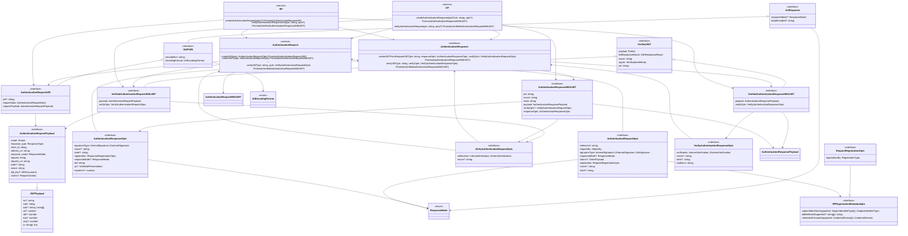

```mermaid
classDiagram

class RP {
    <<service>>
    createAuthenticationRequest(opts?) Promise(AuthenticationRequestURI)
    verifyAuthenticationResponseJwt(jwt: string, opts?) Promise(VerifiedAuthenticationResponseWithJWT)
}
RP --> AuthenticationRequestURI
RP --> VerifiedAuthenticationResponseWithJWT
RP --> AuthenticationRequest
RP --> AuthenticationResponse

class OP {
    <<service>>
    createAuthenticationResponse(jwtOrUri: string, opts?) Promise(AuthenticationResponseWithJWT)
    verifyAuthenticationRequest(jwt: string, opts?) Promise(VerifiedAuthenticationRequestWithJWT)
}
OP --> AuthenticationResponseWithJWT
OP --> VerifiedAuthenticationRequestWithJWT
OP --> AuthenticationRequest
OP --> AuthenticationResponse


class AuthenticationRequestOpts {
  <<interface>>
  redirectUri: string;
  requestBy: ObjectBy;
  signatureType: InternalSignature | ExternalSignature | NoSignature;
  responseMode?: ResponseMode;
  claims?: ClaimPayload;
  registration: RequestRegistrationOpts;
  nonce?: string;
  state?: string;
}
AuthenticationRequestOpts --> ResponseMode
AuthenticationRequestOpts --> RPRegistrationMetadataOpts


class RPRegistrationMetadataOpts {
  <<interface>>
  subjectIdentifiersSupported: SubjectIdentifierType[] | SubjectIdentifierType;
  didMethodsSupported?: string[] | string;
  credentialFormatsSupported: CredentialFormat[] | CredentialFormat;
}

class RequestRegistrationOpts {
  <<interface>>
  registrationBy: RegistrationType;
}
RequestRegistrationOpts --|> RPRegistrationMetadataOpts


class VerifyAuthenticationRequestOpts {
  <<interface>>
  verification: InternalVerification | ExternalVerification;
  nonce?: string;
}

class AuthenticationRequest {
    <<service>>
    createURI(opts: AuthenticationRequestOpts) Promise(AuthenticationRequestURI)
    createJWT(opts: AuthenticationRequestOpts) Promise(AuthenticationRequestWithJWT);
    verifyJWT(jwt: string, opts: VerifyAuthenticationRequestOpts) Promise(VerifiedAuthenticationRequestWithJWT)
}
AuthenticationRequest <-- AuthenticationRequestOpts
AuthenticationRequest <-- VerifyAuthenticationRequestOpts
AuthenticationRequest --> AuthenticationRequestURI
AuthenticationRequest --> AuthenticationRequestWithJWT
AuthenticationRequest --> VerifiedAuthenticationRequestWithJWT

class AuthenticationResponse {
  <<interface>>
  createJWTFromRequestJWT(jwt: string, responseOpts: AuthenticationResponseOpts, verifyOpts: VerifyAuthenticationRequestOpts) Promise(AuthenticationResponseWithJWT)
  verifyJWT(jwt: string, verifyOpts: VerifyAuthenticationResponseOpts) Promise(VerifiedAuthenticationResponseWithJWT)
}
AuthenticationResponse <-- AuthenticationResponseOpts
AuthenticationResponse <-- VerifyAuthenticationRequestOpts
AuthenticationResponse --> AuthenticationResponseWithJWT
AuthenticationResponse <-- VerifyAuthenticationResponseOpts
AuthenticationResponse --> VerifiedAuthenticationResponseWithJWT

class AuthenticationResponseOpts {
  <<interface>>
  signatureType: InternalSignature | ExternalSignature;
  nonce?: string;
  state?: string;
  registration: ResponseRegistrationOpts;
  responseMode?: ResponseMode;
  did: string;
  vp?: VerifiablePresentation;
  expiresIn?: number;
}
AuthenticationResponseOpts --> ResponseMode

class AuthenticationResponseWithJWT {
  <<interface>>
  jwt: string;
  nonce: string;
  state: string;
  payload: AuthenticationResponsePayload;
  verifyOpts?: VerifyAuthenticationRequestOpts;
  responseOpts: AuthenticationResponseOpts;
}
AuthenticationResponseWithJWT --> AuthenticationResponsePayload
AuthenticationResponseWithJWT --> VerifyAuthenticationRequestOpts
AuthenticationResponseWithJWT --> AuthenticationResponseOpts


class VerifyAuthenticationResponseOpts {
  <<interface>>
  verification: InternalVerification | ExternalVerification;
  nonce?: string;
  state?: string;
  audience: string;
}

class ResponseMode {
    <<enum>>
}

 class UriResponse {
    <<interface>>
    responseMode?: ResponseMode;
    bodyEncoded?: string;
}
UriResponse --> ResponseMode
UriResponse <|-- SIOPURI

class SIOPURI {
    <<interface>>
    encodedUri: string;
    encodingFormat: UrlEncodingFormat;
}
SIOPURI --> UrlEncodingFormat
SIOPURI <|-- AuthenticationRequestURI

class AuthenticationRequestURI {
  <<interface>>
  jwt?: string; 
  requestOpts: AuthenticationRequestOpts;
  requestPayload: AuthenticationRequestPayload;
}
AuthenticationRequestURI --> AuthenticationRequestPayload

class UrlEncodingFormat {
    <<enum>>
}

class ResponseMode {
  <<enum>>
}

class AuthenticationRequestPayload {
    <<interface>>
    scope: Scope;
    response_type: ResponseType;
    client_id: string;
    redirect_uri: string;
    response_mode: ResponseMode;
    request: string;
    request_uri: string;
    state?: string;
    nonce: string;
    did_doc?: DIDDocument;
    claims?: RequestClaims;
}
AuthenticationRequestPayload --|> JWTPayload

class  JWTPayload {
  iss?: string
  sub?: string
  aud?: string | string[]
  iat?: number
  nbf?: number
  exp?: number
  rexp?: number
  [x: string]: any
}


class VerifiedAuthenticationRequestWithJWT {
  <<interface>>
  payload: AuthenticationRequestPayload; 
  verifyOpts: VerifyAuthenticationRequestOpts; 
}
VerifiedJWT <|-- VerifiedAuthenticationRequestWithJWT
VerifiedAuthenticationRequestWithJWT --> VerifyAuthenticationRequestOpts
VerifiedAuthenticationRequestWithJWT --> AuthenticationRequestPayload

class VerifiedAuthenticationResponseWithJWT {
  <<interface>>
  payload: AuthenticationResponsePayload;
  verifyOpts: VerifyAuthenticationResponseOpts;
}
VerifiedAuthenticationResponseWithJWT --> AuthenticationResponsePayload
VerifiedAuthenticationResponseWithJWT --> VerifyAuthenticationResponseOpts
VerifiedJWT <|-- VerifiedAuthenticationResponseWithJWT

class VerifiedJWT {
  <<interface>>
  payload: Partial<JWTPayload>;
  didResolutionResult: DIDResolutionResult;
  issuer: string;
  signer: VerificationMethod;
  jwt: string;
}
```
