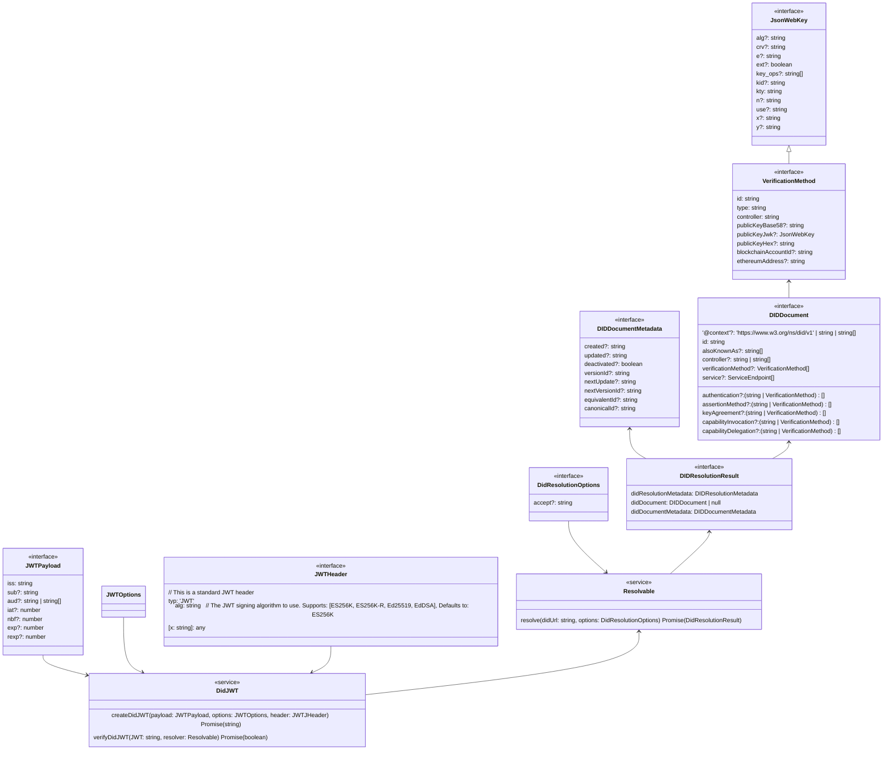

```mermaid
classDiagram
class DidResolutionOptions {
    <<interface>>
    accept?: string
}
class Resolvable {
    <<service>>
    resolve(didUrl: string, options: DidResolutionOptions) Promise(DidResolutionResult)
}
DidResolutionOptions --> Resolvable
DIDResolutionResult <-- Resolvable

class  DIDResolutionResult {
  <<interface>>
  didResolutionMetadata: DIDResolutionMetadata
  didDocument: DIDDocument | null
  didDocumentMetadata: DIDDocumentMetadata
}
DIDDocumentMetadata <-- DIDResolutionResult
DIDDocument <-- DIDResolutionResult

class DIDDocumentMetadata {
  <<interface>>
  created?: string
  updated?: string
  deactivated?: boolean
  versionId?: string
  nextUpdate?: string
  nextVersionId?: string
  equivalentId?: string
  canonicalId?: string
}

class DIDDocument {
    <<interface>>
    '@context'?: 'https://www.w3.org/ns/did/v1' | string | string[]
    id: string
    alsoKnownAs?: string[]
    controller?: string | string[]
    verificationMethod?: VerificationMethod[]
    authentication?: (string | VerificationMethod)[]
    assertionMethod?: (string | VerificationMethod)[]
    keyAgreement?: (string | VerificationMethod)[]
    capabilityInvocation?: (string | VerificationMethod)[]
    capabilityDelegation?: (string | VerificationMethod)[]
    service?: ServiceEndpoint[]
}
VerificationMethod <-- DIDDocument

class VerificationMethod {
    <<interface>>
    id: string
    type: string
    controller: string
    publicKeyBase58?: string
    publicKeyJwk?: JsonWebKey
    publicKeyHex?: string
    blockchainAccountId?: string
    ethereumAddress?: string
}

class JWTPayload {
    <<interface>>
    iss: string
    sub?: string
    aud?: string | string[]
    iat?: number
    nbf?: number
    exp?: number
    rexp?: number
}
class JWTHeader { // This is a standard JWT header
    <<interface>>
    typ: 'JWT'
    alg: string   // The JWT signing algorithm to use. Supports: [ES256K, ES256K-R, Ed25519, EdDSA], Defaults to: ES256K
    [x: string]: any
}

JsonWebKey <|-- VerificationMethod
class JsonWebKey {
  <<interface>>
  alg?: string
  crv?: string
  e?: string
  ext?: boolean
  key_ops?: string[]
  kid?: string
  kty: string
  n?: string
  use?: string
  x?: string
  y?: string
}


class DidJWT {
    <<service>>
    createDidJWT(payload: JWTPayload, options: JWTOptions, header: JWTJHeader) Promise(string)
    verifyDidJWT(JWT: string, resolver: Resolvable) Promise(boolean)
}
JWTPayload --> DidJWT
JWTOptions --> DidJWT
JWTHeader --> DidJWT
Resolvable <-- DidJWT

```
